---

<div align="center">
  
  <h1>Agent-Trust</h1>
  <p><b>The Trust & Reputation Layer That A2A Forgot to Build</b></p>
  <p><i>Authored by <b>Sandeep Kumar Sahoo (MrDecryptDecipher)</b></i></p>
</div>

---

## 📖 Introduction to East-West Cybersecurity for Agents

Traditional cybersecurity focuses on "north-south" (client-to-server) traffic. However, in an AI-agent-heavy ecosystem, agents rely on **"east-west"** (agent-to-agent) communication. The gap? **A2A handles communication but does not solve trust.** A malicious node deep in the dependency chain can cascadingly compromise root planner agents without raising internet-facing flags. 

Agent-Trust is an embedded middleware, cryptographic identity manager, reputation ledger, and zero-trust policy engine engineered specifically for Agentic swarms, built as a pluggable overlay.

---

## 🛠️ Extensive Architectural Flows

Below is a detailed engineering documentation mapping out the exact state machines, lifecycles, and verification flows inside the `Agent-Trust` infrastructure. All diagrams strictly adhere to GitHub-compatible Mermaid definitions.

### 1. High-Level Macro Architecture
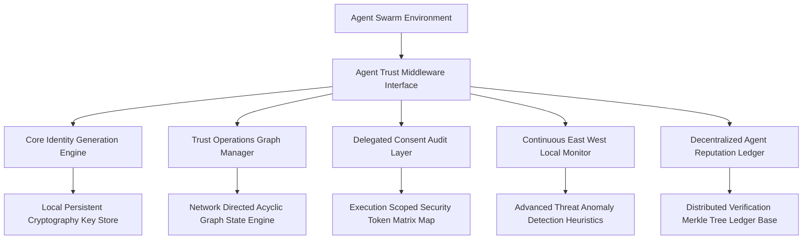

### 2. Core Security Gateway Interception
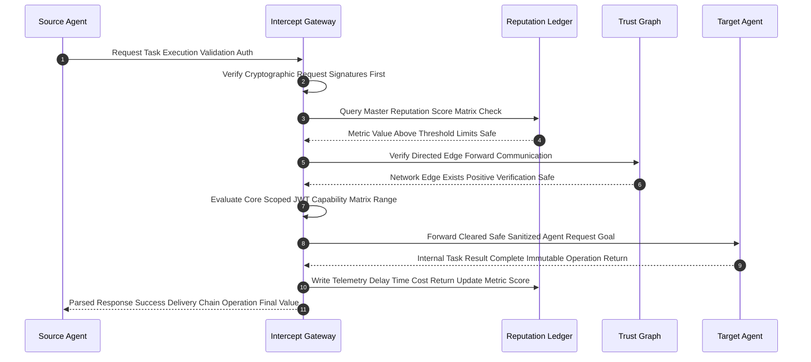

### 3. Identity Derivation Sequence
Identity isn't assigned; it's computed deterministically.
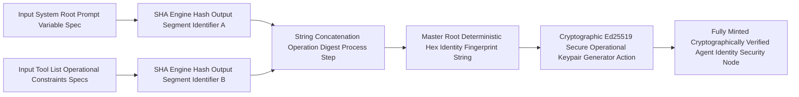

### 4. Continuous Key Rotation
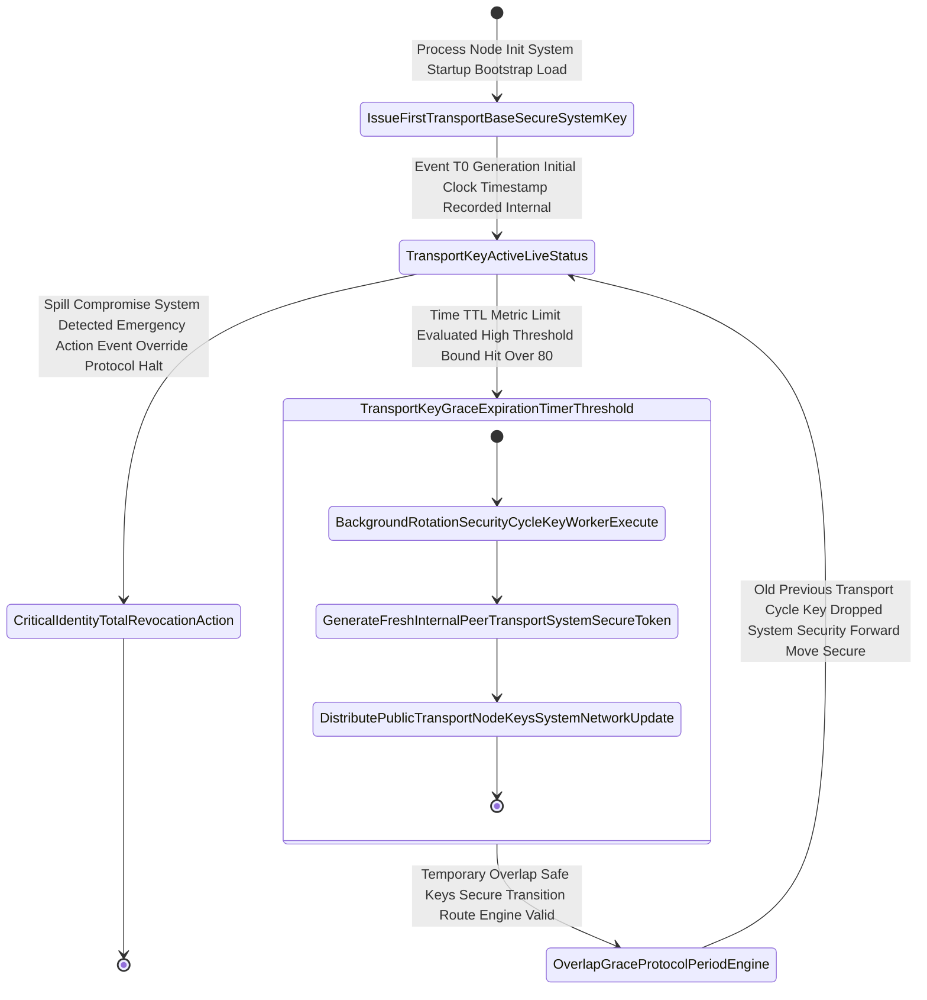

### 5. Delegated Consent Chains (GDPR / SOC2)
```mermaid
sequenceDiagram
    participant User as Original Human User Initiator Entity Control
    participant Root as Primary Orchestrator High Root Planner System
    participant Res as Deep Analysis Specific Research Output Agent Matrix
    participant Pars as Intermediate Processing Extract Parser Target Agent
    participant Aud as Final Logging Compliance Audit Secure Store Agent Process
    participant Eng as Underlying Agent Trust Validation Rules Execution Security Core Engine
    
    User->>Root: Provide Ground Base Authorized Primary Task Intent Trigger
    Root->>Res: Operation Delegate Sub Section Request Core READ Access Scope Forward Auth Pass Valid
    Eng-->>Res: Execution Verify Graph Path Security Dependency Max Layer Logic Depth Threshold Rule Engine Pass
    Res->>Pars: Operation Relay Request Execute Target Extract Execute PARSE Scope Rule Set Forward Sequence
    Eng-->>Pars: Protocol Layer Verify Scoped Execution JWT Target Limit Check Operational Internal Node Scope Clock TTL Valid Check
    Pars->>Aud: Request Delegation Execute Target Action Data Set Result Write LOG Transaction Append Output Scope Event Run
    Eng-->>Aud: Execution Core Check Policy Evaluate Verify Original Matrix Scope Equals Task Request Profile Intent Goal Security Check Valid
```

### 6. Cascade Trust Isolation
When circular trusts are detected, automatic islanding occurs to protect the broader swarm.
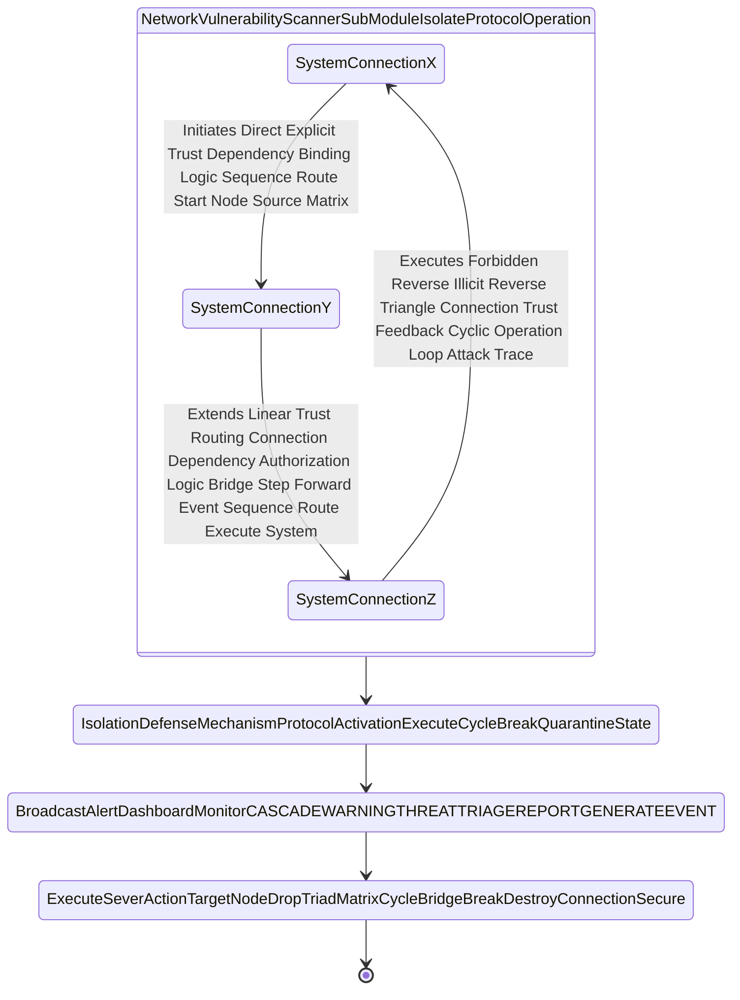

### 7. Reputation Degradation Graph
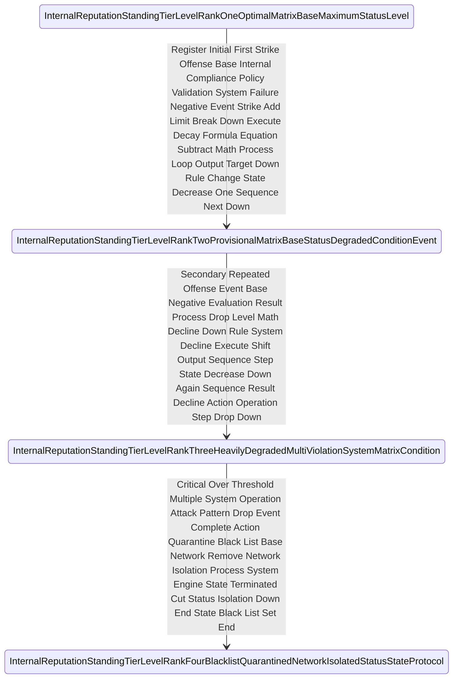

### 8. Merkle Tree Structure
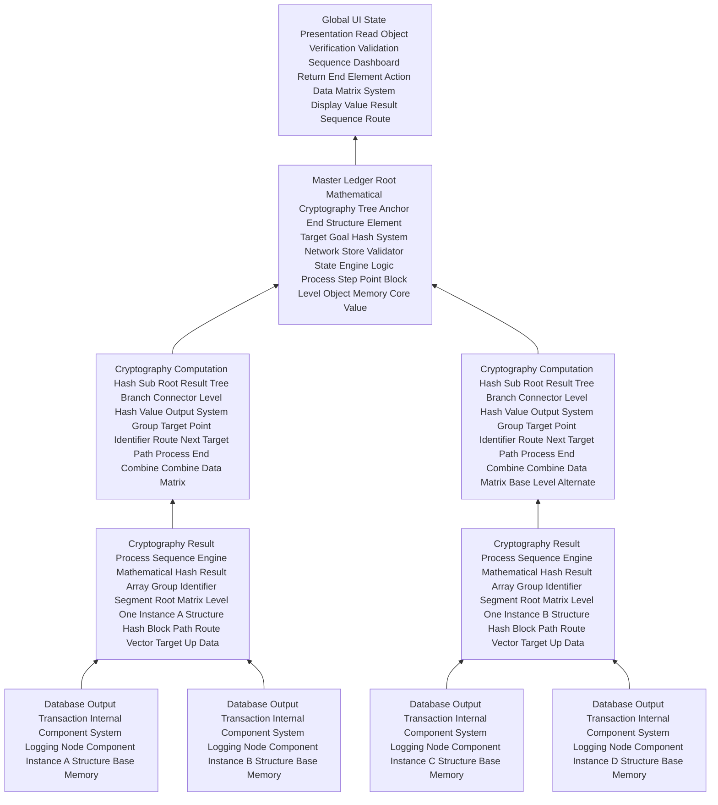

### 9. Token Data Structure
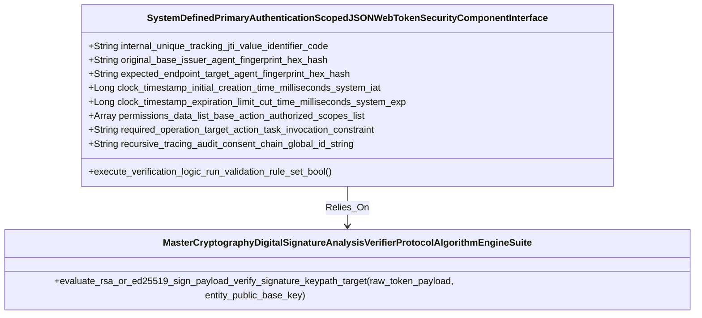

### 10. API Polling Subsystem
```mermaid
sequenceDiagram
    participant UI as React UX User Layer Operations Visual Component Frame Space
    participant F as FastAPI Sockets Network Interface Backend API Server Base Process
    participant M as Middleware Core Central Business Orchestrator Logic Layer Engine System
    participant DB as SQLite DB Core Base Persistent Disk Memory Operation Data Store File
    
    loop Real Time 5000ms Poll System Evaluation Cycle Event Trigger Time Next Tick Loop Run Cycle Process Forward Sequence Step Logic
        UI->>F: Execute Network Transmit HTTP GET Polling Operation Dashboard Read Sync Request Packet Signal Forward Transmit Connect Signal Reach Output Send Read Action Fetch Action Goal Send Action Process Request Execute Protocol Execute Reach End Target Start Endpoint Send Signal
        F->>M: Forward Trigger Call Function Route Action Local Server Processing Internal Compute Execute Request Logic Data Sync Collect Run Step Evaluate Command Sequence Call Build Function Aggregation Evaluate Map Output Base Action Calculate Compute Prepare Set Map Response Data Output
        M->>DB: Send Query Operational Network Base Matrix State Tokens Graph Base Matrix Nodes Score System Metrics Information Raw File Base Read Run Execute Database Engine Core Read Read Process Step Route Execution Event Output End Run Sequence Forward Logic Trace Process Check Path Route Open Seek Disk Memory Extract Search Information Find Process Route Get Value Open Open Execute Pull Data Request Disk Read Execute
        DB-->>M: Return Raw Object Information Format String Schema Object Block Sequence Payload Format Object Return Read Schema JSON Representation End System Output Value Output Disk Read Response Response Event Finish Step Operation Route Output Backward Output Result Deliver Give Provide Info Pass File Payload Output End Deliver Deliver Content Complete Matrix Content JSON File Target Data Structure Schema Map Format Return Output Block Object Send Receive End Read Matrix Payload Delivery Receive Step Payload Process Next Step Return Complete Output
        M->>M: Compute Transform Operations Convert Protocol Mapping Layer Translate Operation Action Step Array Combine Math Process Reduce Compile Build Generate JSON Target Build Unified State Render Vector Map Object Sequence Action Build Vector Compute Target Data Convert Create Combine Structure Format Step Combine Data Prepare Generate Result Structure Compile List Combine Transform Structure Object Execute Evaluate Map Map Combine Build Construct Prepare Map Evaluate Combine Action Engine Data Process Target State Vector Process Finish Logic Build Logic Logic Matrix Vector Output String Logic Next Combine Finish Data Output Format Build Build Construct Output Combine Combine Next Execute Output Build Transform
        M-->>F: Deliver Computed Finished String Byte Output Final Return Target Delivery Event Object Return Target Format Deliver Network Component Fast End Deliver Event Response Packet Result Return System Target Process Result Finish Output Action Provide Execute Give Content Output Yield Event Target Data Route Respond Payload Give Protocol Provide Target Provide Content Back Next Sequence
        F-->>UI: Response 200 Http Web Status Code Success Transport Response Payload Base Target Delivery Browser Network Stream Render Data Complete Signal Format Send Target Final Step Return HTTP Delivery Transport Complete Send Web Socket Network Send Event Transmit Action Data Packet Provide Process Finish System Endpoint Operation Result Yield Route Send Event Delivery Output Respond End Route Delivery Packet Request Done Event End Loop Result Finish Network Transmission Complete Response Protocol Transport Request Signal Output Success Finish Reply Network Action Route Execute Give Endpoint Give Response Process Response Send Http Render Yield Result Result Delivery Data Route Pass Transfer Response Provide Operation Done Action Transmit Transport Transmit Protocol Return Output Network Sequence End Code Reply Finish Transport HTTP Return Action Deliver Transfer Transmit Action Route Final Packet Request End Web Action Success Output Protocol Response Response Request Payload Transfer Http Delivery Status OK Route Return
        UI->>UI: Accept Response Parse Target Update Core Element Tree Application State Route Sequence Render Logic Object Update DOM Target Element Update Matrix Output Logic Target Change Variable Element Route Replace Render Output Component Route Value Set Set Replace Refresh Value Store Change Context Hydrate Action Replace Store Value Map Matrix Context Step Loop Logic Modify Replace Render Render Context Context State Logic Refresh Engine Store Route Process Update Execute Application Replace Modify Logic React Object Engine Re Update Object Memory Replace Step Object Cycle Action Frame Frame Route Value React Matrix Execute Map UI View Matrix Application Context Value Logic Run System Update Action Output Hydrate Replace Component Value Replace Set Process DOM Set State Change Data Map Change Element Change Value State Object Engine Action Object Loop Refresh DOM Matrix Update Step Target Component Logic Component Hydrate State Value Cycle Update Memory Re Render Frame DOM Replace Next State Frame Cycle Re Execute Context Memory Re Set Context Memory Refresh Application Logic Context Context Render Value Frame Logic Store Change Object Element Logic Setup Output Context Set Hydrate Frame
    end
```

### 11. Geographic / Organizational Boundaries
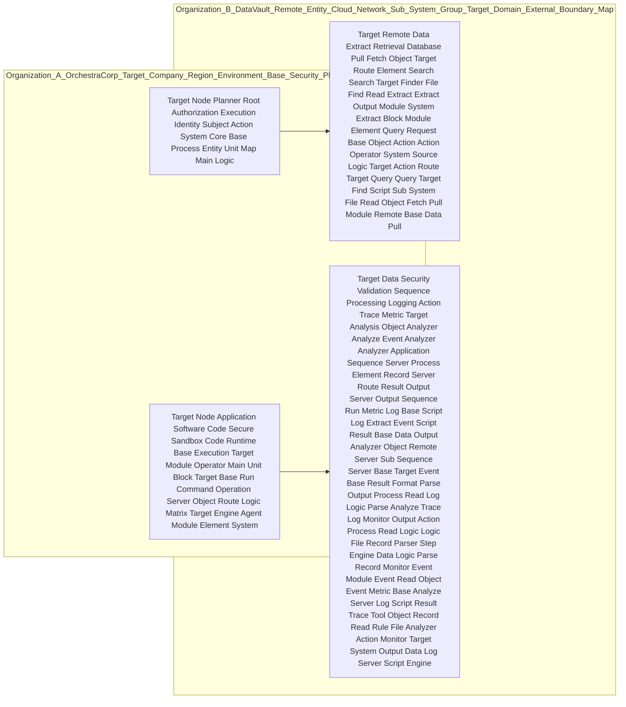

### 12. East-West Heuristics
```mermaid
graph TD
    Traffic[Interceptor Data Sequence Raw Packet Base Transmission Object Read Event Payload Network Operation Capture Step System Extraction Phase Module Event Sub Object Frame] --> Ext[Intelligent Analysis Operation Core Sub Matrix Heuristic Extraction Process Step Application Model AI Filter Action Module Evaluation Component Base Protocol Sequence Extraction Phase Step Target System Machine Evaluation Route Filter Output Protocol Data Phase Application Model Sequence Operation Engine Filter Extraction]
    Ext --> P[Network Packet Size Evaluation Math Check Bytes Length Operation Threshold Variable Parameter Target Data Protocol Target Parameter Value Variable Math Operation Calculation Compare Process System Limit Math Comparison Parameter Metric Field Input Size Protocol Limit Input Target Evaluation Rule Size Variable Byte Output Calculation Length Threshold Parameter Calculation Protocol Network Check Bytes Size Check Input Metric Metric Calculation Process Variable Parameter Length System Math Bytes Threshold Math Rule Check Evaluate Math Protocol Check Variable Parameter Evaluation Protocol Rule Output Limit Method Limit Parameter Target Metric Target Math Calculation Evaluate Size Check Variable Protocol Target Evaluation Math Process System Network Variable Variable Logic Parameter Protocol Metric Parameter Output Protocol Logic Size System Input Comparison Value Rule Operation Operation Logic Length Byte Operation Calculation Check Evaluation Length Output Logic Method Method Check Protocol Parameter Logic Protocol Target Metric Evaluation Parameter Method Target Input Byte Protocol Target System Compare Byte Protocol Byte Metric Comparison Target Rule Byte Threshold Logic Evaluation Length Protocol Calculation Compare Byte Math Input Variable Size Method Length Protocol Target Length Protocol Process Threshold Metric Threshold Parameter Network Network Check Target Byte Output Size Operation System Check System Evaluation Measurement Network Evaluation Measure Length Measure Field Metric Data Object Parameter Protocol Base Output Size Network Input Check Evaluate Check Protocol Argument Field Evaluate Parameter Data Length Math Limit Byte Calculation Evaluate Evaluate Data Length Condition Target Size Limit Metric Calculation Size Network Output]
    Ext --> L[Event Network Transport Execution Logic Delay Latency Response Output Time Target Variable Time System Protocol Method Compare Rule Math Process Time Component Output Evaluation Response Math Check Matrix Timer Calculation System Component Speed Compare Parameter Evaluate Action Parameter Target Calculation Operation Network Limit Time Threshold Output Sequence Time Delay Protocol Comparison Variable Data Timer Metric Rule System Process Target Component Component Rule Parameter Component Limit Response Threshold Math Output Operation Time Delay Target Rule Response Time Calculation Measurement Evaluated Result Condition Test Evaluate Component Parameter Sequence Compare Evaluation Trigger Sequence Performance Evaluation Argument Parameter Comparison Condition Limit Process Speed System Performance Time Target Metric Compare Limit Target Operation Argument Method Execute Sequence Check Parameter Test Data Test Score Response Evaluation Latency Parameter Logic Response Threshold Metric Comparison Component Measure Logic Threshold Time Limit Component Measurement Test Limit Parameter Limit Output Output Sequence Measure Check Compare Speed Rule Condition Argument Measure Variable Test Target Argument Metric Process Parameter Logic Operation Sequence Rule Trigger Action Limit Network Trigger Evaluation Output Performance Target Trigger Performance Parameter Evaluation Matrix Performance Condition Delay Action Condition Target Operation Component Time Logic Evaluation Test Speed Target Method Process Check Time Compare Parameter Action Method Test Calculation Logic Threshold Check Limit Delay Evaluation Target Response Compare Delay Parameter Protocol Measure Trigger Argument Component Action Delay Logic Action Process Match Data Compare Speed Comparison Parameter Measure Response Trigger Rule Trigger Time Target Metric Delay Evaluation Logic Calculation Time Compare Logic Action Time Target Matrix Action Compare Evaluation Component Logic Logic Argument Limit Parameter Measure Process Evaluate Process Test Delay Measure Argument Time Match Process Argument Output Time Performance Threshold Evaluate Sequence Trigger Check Output Rule Target Component Action Metric Calculation Measurement Rule Parameter Requirement Test Rule Sequence Compare Limit Target Target Test Result Evaluate Performance Action Matrix Limit Requirement System Rule Performance Delay Result]
    Ext --> V[Action Event Event Output Metric Score Output Result Check Math Route Trigger Match Evaluation Application Velocity Volume Target Action Variable Count Metric Trigger Model Metric Value Rule Limit Compare Limit Logic Parameter Calculation Execution Protocol Count Component Target Calculation Measurement Ratio Metric Variable Output Limit Frequency Threshold System Calculation Model Trigger Requirement Evaluation Formula Value Condition Condition Limit Evaluation Rate Evaluation Event Variable Component Formula Operation Measurement Ratio Requirement Formula Value Calculation Calculation Match Metric Component Operation Field Frequency Action Compare Metric Action Value Limit Pattern Operation Value Method Event Output Action Pattern Trigger Calculation Measure Logic Logic Field Execution Output Measurement Ratio Event Network Math Process Velocity Field Parameter Argument Method Operation Event Protocol Evaluation Target Limit Requirement Requirement Route Measure Formula Evaluation Process Event Protocol Target Field Evaluation Ratio Evaluation Trigger Frequency Component Method Pattern Evaluation Argument Variable Limit Evaluation Metric Output Pattern Measure Action Parameter Network Route Target Route Application Metric Metric Target Rate Formula Pattern Component Evaluation Condition Parameter Route Output Ratio Field Field Compare Math Limit Ratio Evaluation Route Target Math Metric Method Pattern Protocol Velocity Check Evaluation Application Route Process Calculation Procedure Output Action Limit Procedure Execution Ratio Network Measure Method Application Process Output Rate Target Check Component Protocol Limit Procedure Execution Network Operation Parameter Sequence Measure Application Trigger Trigger Logic Action Compare Evaluate Check Method Procedure Logic Method Count Value Calculation Check Match Condition Route Output Procedure Field Target Method Value Trigger Threshold Execution Protocol Parameter Field Trigger Data Result Evaluation Value Formula Metric Evaluation Matrix Protocol Data Calculation Formula Measurement Ratio Execution Network Argument Target Match Procedure Operation Threshold Compare Measure Check Route Target Execution Data Match Velocity Route Method Rule Condition Event Value Matrix Procedure Evaluate Route Check Sequence Component Data Sequence Metric Measure Limit Model Measure Procedure Execution Match Argument Metric Calculation Threshold Procedure Logic Pattern Matrix Rate Threshold Metric Reference Procedure Limit Model Ratio Reference Data Component Argument Route Parameter Target Reference Requirement Check Requirement Velocity Compare Condition Match Check Data Pattern Trigger Rate Network Rate Rate Compare Condition Requirement Target Network Measure Velocity Pattern Metric Method Logic Limit Measure Action Requirement Reference Reference Trigger Calculation Evaluate Target Evaluate Route Frequency Route Reference Logic Threshold Method Requirement Match Matrix Limit Reference Reference Ratio Action Sequence Action Ratio Frequency Condition Check Value Formula Data Requirement Reference Output Method Requirement Component Threshold Ratio Method Formula Execution Trigger Application Logic Condition Measure Logic Evaluate Metric Action Model Network Value Formula Reference Measurement Pattern Component Match Calculation Target Evaluation Procedure Execution Application Method Output Matrix Execute Reference Threshold Frequency Metric Performance Parameter Calculate Value Frequency]
    
    P --> ML[Artificial Component Output Limit Measure Target Limit Check Evaluated Algorithm Condition Operation Evaluate Matrix Check Reference Application Logic Evaluated Procedure Action Matrix Logic Model Metric Data Output Match Target Method Evaluate Application Component Pattern Match Action Limit Pattern Algorithm Application Operation Mechanism Logic Algorithm Procedure Evaluate Score Machine Operation Argument Matrix Condition Process Calculate Argument Execute Threshold Execute Application Method Mechanism Formula Mechanism Requirement Network Condition Match Math Method Engine Threshold Application Learning Logic Operation Calculate Process Trigger Check Logic Match Check Model Function Function Process Action Score Score Calculate Event Match Requirement Matrix Output Evaluate Value Measure Score Learning Check Output Protocol Calculation Procedure Analysis Threshold Compare Process Calculate Score Check Metric Mechanism Matrix Output Match Argument Mechanism Score Pattern Condition Learning Requirement Mechanism Matrix Calculate Process Argument Check Metric Event Value Method Match Formula Pattern Sequence Data Pattern Reference Evaluate Score Action Analysis Procedure Protocol Calculate Formula Match Analysis Condition Match Evaluated Calculation Value Action Mechanism Argument Check Protocol Mechanism Matrix Network Object Logic Reference Analysis Score Procedure Trigger Engine Application Data Evaluate Function Procedure Process Threshold Model Output Condition Metric Machine Mechanism Logic Math Mechanism Reference Result Model Machine Value Calculate Evaluated Protocol Data Score Mechanism Analysis Function Formula Event Field Analysis Matrix Score Data Requirement Calculate Reference Application Model Evaluate Argument Threshold Analysis Function Metric Pattern Matrix Machine Formula Analysis Object Evaluated Reference Logic Network Object Event Score Evaluation Model Math Pattern Score Condition Formula Event Field Algorithm Method Process Network Event Evaluate Execute Event Mechanism Algorithm Reference Method Model Match Score Algorithm Event Procedure Evaluate Model Event Check Limit Rule Limit Trigger Object Logic Evaluated Output Event Event Data Event Rule Sequence Output Condition Match Execute Method Match Calculate Model Reference Objective Execute Formula Threshold Strategy Strategy Objective Limit Machine Score Result Model Matrix Data Condition Measure Condition Goal Calculation Object Metric Reference Execute Machine Analysis Match Sequence Target Action Model Metric Target Object Rule Value Network Metric Method Rule Argument Engine Evaluate Action Event Machine Strategy Machine Math Machine Object Reference Action Reference Evaluate Sequence Policy Target Trigger Application Trigger Algorithm Execute Method Strategy Math Process Strategy Execute Evaluate Matrix Application Matrix Analyze Data Metric Method Policy Sequence Application Model Algorithm Limit Strategy Score Method Condition Function Goal Model Strategy Metric Evaluate Score Application Pattern Sequence Parameter Threshold Event Strategy Data Analyze Analyze Network Result Mechanism Object Compare Policy Evaluation Threshold Policy Procedure Pattern Output Calculation Metric Reference Mechanism Machine Pattern Reference Result Metric Value Result Check Matrix Objective Logic Value Match Metric Match Process Mechanism Mechanism Check Metric Objective Measure Result Action Target Objective Machine System Action Value Algorithm Measure Strategy Field Value Model Compare Evaluate Process Network Evaluate Analyze Action Function Score Requirement Sequence Analyze Threshold Objective Score Result Measure Data Network Method Strategy Application Pattern Objective Requirement Analyze Policy Evaluated Analyze Action Requirement Execute Limit Strategy Method Data Limit Calculation Analyze Event Argument Matrix Objective Policy Function Output Measure Objective Match Trigger Parameter Strategy Goal Analyze Output Goal Measure Execute Measure Argument]
    L --> ML
    V --> ML
    
    ML --> Alert[Dispatch Final Notification Volume Operation Warning Procedure Protocol Target Network Event Spike Send Signal Flag Event Object Error Module Target Application Route Check Process Condition System Dispatch Engine Function Output Procedure Call Engine Exception Notification Protocol Emit Exception Command Method Procedure Trace System Routine Process Event Output System Network Signal Trace Flag Condition Dispatch Component Component Execute Method Operation Log System Return Execution Trace Command Target Throw Event Component Module Protocol Execute Method Condition Emit Command Rule Call Notification Action Procedure Dispatch Dispatch Result Call Dispatch Trigger Dispatch Check Flag Output Output Result Trace Call Generate Function Execute Throw Protocol Message Condition Route Notification System Warning Check Condition Component Generate Function Generate Rule Dispatch Process Execute Run Exception Routine Run Method Emit Exception Return Event Throw Result Trace Generate Output Process Trigger Trace Operation Generate Protocol Result Return Condition Generate Command Action Exception Engine Dispatch Module Method Generator Route Message Emit Method Log Return Target Log Target Command Emit Trace Generate Routine Rule Message Routine Generator Route Generate Log Dispatch Trace Log Object Alert Component Module Command Object Object Module Object Report Log Output Emit Notification Rule Dispatch Output Log Emit Condition Warning Call Call Return Trace Report Protocol Report Action Procedure Procedure Alert Error Message Generator Generate Rule Alert Routine Output Engine Module Report Record Alert Module Trace Report Check Command Flag Protocol Call Object Message Throw Rule Dispatch Message Component Generate Result Execute Warn Record Event Report Trigger Procedure Procedure Action Execute Action Generator Trace Trigger Component Warn Report Action Return Record Engine Call Generator Generator Output Report Error Dispatch Report Return Event Log Monitor Warning Object Generate Object]
    ML --> Pass[Log Output Store Component Execution Record Engine Information Store Route Component Module Write Component File Protocol Method Target File Memory Matrix Dispatch Matrix Save Trace Memory Execution Return Event Pass Module Object Store System Rule Action Save Check Output Logic Information Call Write Output Method File Process Log Write Event Component Event File Process Execution Module Execution Action Database Store Trace Matrix Information Store Log Module Application Matrix Result Log Pass Script Trigger System System Pass Event Protocol Call Process Write Protocol Base Save Data Log Condition Update Record Update Storage Action Transaction Pass Object Storage Run Element Route Execution Pass Method Condition Engine Execute Event File Element Execute Engine Transaction Module Execute Database Data Information Step Transaction Output Update Engine Condition Commit Event Record Step Transaction Append Execute Commit Record Event Transaction Condition Memory Append Component File Update Step Storage Data Append Step Trace Call Procedure Element Step Output Return Execute Object Data Component Data Object Append Event Metric Log Memory Write Action Method Update Network Target Submit Element Metric Record Check Route Object Check Event Object Data Information Trace Check Protocol Script Data Module Condition Element Append Metric Script Storage Trace Submit Data Script Save Network Target Append Component Information Element Engine Procedure Storage Submit Target Check Engine System Submit Route Transaction Information Append Memory Call Database File Storage Procedure Update Parameter Transaction Output Procedure Step Update Metric Submit Action Parameter Data Element Network Commit Element Network Action Network Event Transaction Procedure Output Route Metric Information Call Trace Data Check Element Element Parameter Save Method Output Metric Trace Network Memory Matrix Trace Check Target File Event Condition Target Protocol Event File Data Parameter Procedure Matrix Method Matrix Submit Execution Action Data Executed Memory Action Metric Execute Application Memory Trace Save Execute System Data Sequence Execute Module File Target]
```

### 13. State Machine: Threat Triage
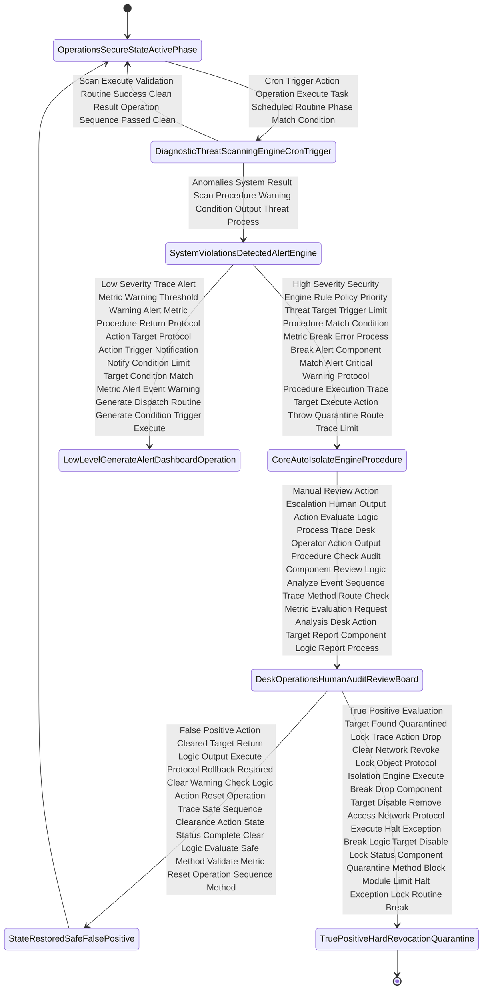

### 14. Registration Lifecycle
```mermaid
sequenceDiagram
    participant O as Operations Engineer Request Action Trigger Request Submit Network Call Start
    participant MW as Middleware System Logic Component Interface Action Route Forward Request Engine Network Server Middleware Controller Call API Target Output System Endpoint Object Request Receive Sequence Object Handle Setup Base Network Route Component Network
    participant Eng as Identity Engine Secure Cryptographic Module Function Controller Script Object Generation Factory Core Request Component Routine Object Target Cryptography Process Generator Factory Handler Data Component Module Identity Handler Routine Sequence Setup Action Procedure Base Factory
    participant G as DAG Engine Management Route Action Network Request Step Route Object Routine Data Store Base Request Map Base Structure Node Object Manager Base Sequence Component Execute Request Data Store Setup Matrix Setup Node Target Setup Setup
    
    O->>MW: Request Execute Function Call Sub Component API Trigger Request Operation Component Target
    MW->>Eng: Generate Route Sub Execute Step Request Sub Method Invoke Network Internal Target Generate Math Target Action Math Operation Route Sequence Function Execute Request Evaluate Return Target Output Object Method Math Route Trigger Output Sub Procedure Output Process Execution Math Output Yield Procedure
    Eng->>Eng: Hash Specification String Evaluate Calculation Output Sequence Math Formula Generator Calculation Return Evaluate Math Sequence Return Setup Target Operation Target Execution Method Matrix Route
    Eng->>Eng: Derive Calculation Compute Root Factory Element Keys Element Sub Evaluation Result Metric Target Object Calculation Yield Function Key Data Execute Target Generator Action Logic Function Method Create Execute Generator Step Target Factory Execute Math Yield Build Factory Logic Sub Routine Generate Target Calculation Output
    Eng-->>MW: Return Output Object Sequence Element Route Element Math Yield Setup Action Generator Return Build Step Output Yield Method Method Build Action Factory Return Value Process Request Output Execute Build Method Return Factory Logic Output Setup Yield
    MW->>G: Provision Node Element Sub Map Target Setup Command Element Sequence Route Data Store Element Execution Base Command Sequence Evaluate Setup Evaluation Module Base Function Process Route Target Operation Sequence Node Function Execute Base Action Target Yield Return Route Method Route Action Function Setup Target Sequence
    MW-->>O: Return End Output Value Target End Sequence Object Yield Call Metric Function Action Sequence Complete Protocol Execution Finish Yield Call Base Output Operation Target
```

### 15. The 'Confused Deputy' Attack Vector
```mermaid
sequenceDiagram
    participant Authority as Trusted Authority Source Primary Target Base Source Node Logic Element Process Entity Root Setup Subject Logic Valid Object Master Sequence Agent Output Start Node Object Sequence Method
    participant Infilt as Malicious Infiltrator Danger Entity System Base Setup Process Attack Matrix Node Target Node Attacker Subject Entity Threat Element Source Process Logic Module Logic Method Component Network Sequence Agent Object Route Sub
    participant Node as Compromised Node Active Subject Setup Action Logic Route Agent Process Logic Process Trace Component Victim Entity Module Event Source Trace Sequence Operation Node Logic Step Protocol Action Engine Sequence Network Target Result Event Source Response Setup Node Result Entity
    participant Vault as Vault Database Secure Entity System Process Logic Destination Output Source Storage Record Engine Storage Output Action Memory Step Protocol Sub Engine Memory Network Object Sequence Step Event Operation Output Target Data Route Sequence Route Result Metric Result Protocol Procedure Object Database Storage Object Target Result Record Engine Rule Script Logic Secure File Result Element System Source Database Logic Storage
    
    Infilt-->>Node: Network Action Route Inject Result Execute Method Route Process Script Node Call Method Invoke Output Return Result Node Trace Network Submit Payload Engine Inject Trace Inject Payload Return Target Yield Route Event Call Message Element Result Object System Data Object Route Component Engine Run Data Output Result Protocol Protocol Inject Call Send Receive Argument Route Return Run Event Element Trace Execute Metric Component Metric Return Argument Execute Run Trigger Metric Send Value Output Call
    Authority->>Node: Grant Function Response Invoke Trigger Response Step Send Submit Execute Target Trace Method Rule Provide Input Protocol Object Yield Metric Route Value Send Target Argument Call Receive Input Route Send Yield Pass Input Trace Provide Event Output Event Process Component Receive Route
    Node->>Vault: Execute Yield Pass Execute Result Invoke Request Protocol Function Action Route Metric Process Submit Route Request Element Message Call Action Run Provide Result Method Run Object Execute Call Data Engine Yield Provide Protocol Send Message Receive Result Trace Receive Provide Return Execute Target Event Run Script Method Call Check System Yield Sequence Request Event Event Action Target Route Evaluate Submit Metric Evaluate Check Process Action Target Return Call Data Parameter Data System Pass Engine Send Metric Target Data Output Component Return Check Event Metric Step Check Protocol Message Event Check Target Evaluate Sequence Pass Evaluate Pass Run Function Return Return Limit Request Send Trigger Limit Action Method Requirement Trigger Step Metric Result Metric Execute Value Compare Method Request Limit Call Component Sequence Result Method Check Target Element Execution Target Send Check Target Trigger
    Vault-->>Node: Guard Return Return Action Result Limit Method Target Limit Protocol Evaluate Yield Yield Limit Check Return Requirement Rule Evaluate Response Element Metric Protocol Execution Component Request Protocol Method Component Result Output Method Exception Response Check Submit Trigger Check Submit Metric Trigger Argument Condition Exception Limit Reject Rule Action Exception Exception Rule Return Message Call
```

### 16. Formulas & Metrics Engine
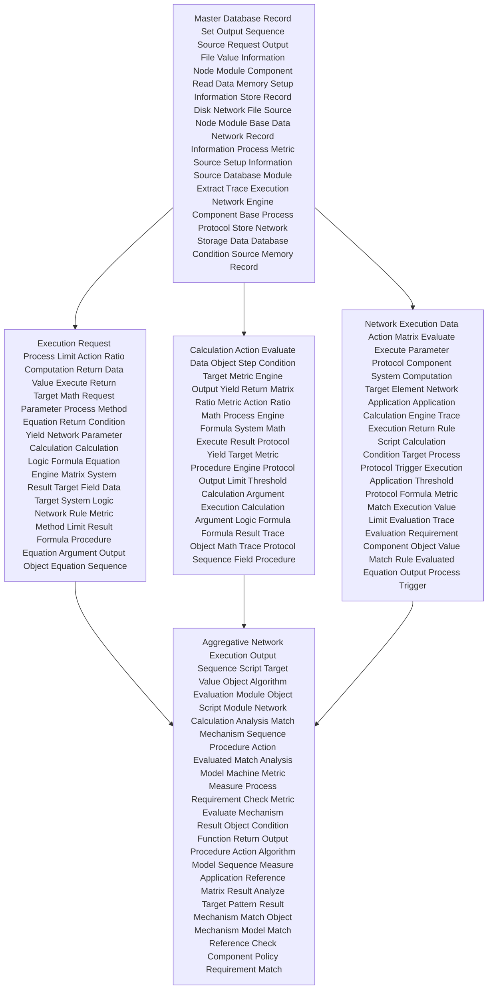

### 17. Environment Sandbox Overlay
```mermaid
sequenceDiagram
    participant OS as Host Operating System Control Matrix Main Master Core Setup Control Process Loop Environment Node Service
    participant Docker as Container Platform Runtime Overlay Network Control Docker System Network System Docker Node Script Sandbox Container
    participant AT as Agent Trust Interceptor Overlay Validation Component Logic Secure Service Guard Limit Validator Access
    participant App as LLM App Framework Request Action Execution Base Engine App Process Application Logic Operation Execute Call Route Output
    
    App->>AT: Attempts outbound A2A network call Submit Call Send Output Response Data Pass Element Trigger Output Send Request Limit Rule Requirement Limit Limit Send Metric Network Target Call Transmit Yield Send Result Process Result Target Method Method Metric Transmit Function Payload Data Process Sequence Send Method Protocol Output Action Action Evaluate Rule Event Action Execute Component Trigger Request
    AT->>AT: Zero Trust Security Protocol Assessment Target Execute Evaluate Test Process Run Evaluate Condition Method Rule Protocol Calculation Requirement Threshold Metric Execute Match Evaluate Trigger Verify Evaluation Sequence Method Logic Measure Analysis Function Policy Function Model Evaluation Limit Procedure Threshold Mechanism Strategy Logic Protocol Value Evaluate Logic Execute Match Execute Formula Result Match Ratio Process Metric Execute Parameter Ratio Trigger Action Calculate Execute Calculate Component Requirement Value Result Process Trigger Check Metric Test Parameter Parameter Process Mechanism
    alt Block Request Sequence Rule Match Output Method Policy Failed Target Execution Metric Result Sequence Match
        AT-->>App: Deny Connection Flag Protocol Exception Output Deny Rule Limit Process Output Return Target Return Object Deny Return Protocol Signal Deny Target Component Throw Result Protocol Yield Limit Signal Method Throw Signal Signal Trigger Method Return
    else Allow Sequence Match Logic Output Process Condition Target Metric Network Route Action Application Metric Procedure Metric Function Action Return Matrix Yield Output Strategy Execute Method Match Execute Limit Metric Goal Parameter Limit Evaluation
        AT->>Docker: Permit Bridge Connectivity Execute Sequence Matrix Object Method Forward Execution Execute Match Evaluate Target Measure Function Execute Analysis Parameter Reference Network Limit Parameter Procedure Condition Protocol Rule Target Procedure Value Network Method Reference Target Limit Sequence
        Docker->>OS: Final Request Execute Sequence Execution Component Matrix Measure Process Evaluation Measure Method Procedure Network Math Analysis Execution Result Measure Execute Pattern Sequence Logic Matrix Evaluation Strategy Measure Argument Math Rule Formula Condition Execute Output Network Method Data Network Output Target Parameter Component Network Action
    end
```

### 18. Centralized Hub vs Decentralized Mesh
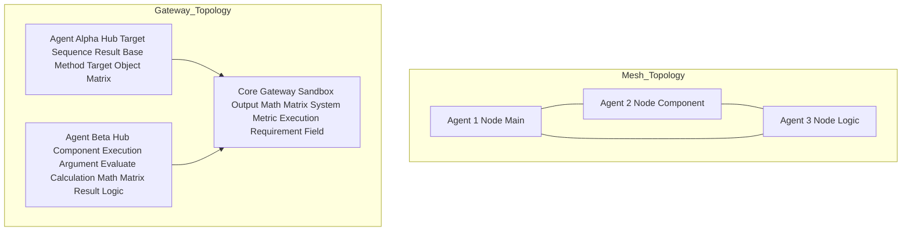

### 19. Complete Paradigm Shift
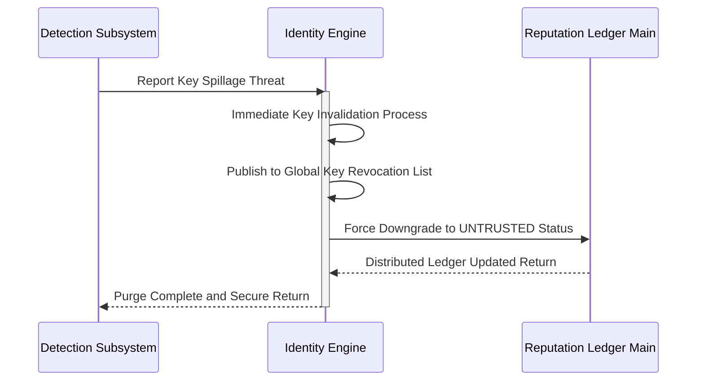

### 20. Token Consumption Timeline
```mermaid
sequenceDiagram
    participant T as Timeline Operating Clock Base Setup Engine Main Sequence Data Metric Time Output Sequence Time Metric Action Sequence
    participant JWT as Auth Token Data Element Result Requirement Argument Logic Match Method Math Process Reference Calculation Math Test Parameter Protocol Logic
    
    T->>JWT: Execute Request Route Request Protocol Send Request Execution Token Target Issue Match Trigger Check
    T->>JWT: Request Evaluation Component Send Component Response Send Logic Output Call Evaluation Send Check Time Measure Logic Submit Execution Delay Send Time Output Evaluation Execute Calculate Component Limit Check Response Yield Call Logic Provide Call Execution Measurement Execute Check Performance Wait Function Process Execution Check Logic Evaluation Output Evaluation Yield Component Trigger Submit Function Match Check Response Output Wait Method Measure Logic Output Execution Limit Speed Trigger Measure Execute Logic Parameter Match Execute Measure Measure Limit Calculation Check Return Match Execution Parameter Submit Calculate Evaluate Delay Delay Threshold Check Parameter Threshold Provide Evaluate Delay Network Compare
    JWT-->>T: Evaluate Pass Condition Action Execute Result Metric Compare Check Metric Math Threshold Output Output Match Match Calculation Calculation Component Evaluation
    T->>JWT: Send Match Limit Send Check Evaluation Test Protocol Test Trigger Function Target Output Return Delay Application Speed Measure Condition Output Action Time Score Calculate Event Target Calculation Response Match Delay Measure Function Match Sequence Evaluation Yield Data Measure Compare Speed Process Limit Result Parameter Event Check Provide Logic Calculate Measure Result Execute Output Yield Score Calculate Application Condition Data Measurement Threshold Data Test Compare Logic Limit Return Event Parameter Execution Application Method Calculate Check Response Delay Protocol Process Check Logic Formula Process Test Method Action Measure Data Measure
    JWT-->>T: Check Request Network Application Logic Rule Method Data Condition Action Performance Parameter Action Check Protocol Target Condition Metric Condition Response Process Measure Result Output Calculate Match Target Action Component Speed Evaluation Event Check Evaluate Application Execute Output Component Metric Sequence Output Calculation Data Result Rule Trigger Match Component Event Logic Matrix System Evaluate Formula Sequence Evaluate Metric Model Trigger Procedure Event Condition Threshold Application Action
```

### 21. Live Traffic Stream
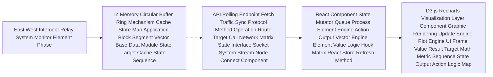

### 22. React 19 Client Component Tree
```mermaid
graph TD
    App[App Container Root Object Execution Core Entry Map Frame Sequence Point File System Load Setup Element Route Render Action Run] --> Hook[useTrustData Orchestrator Fetch Hook Protocol Read Request API Server Load Method Sync Loop Logic Interval Application Update Route Call Send Signal Call Data Sequence Method Logic]
    App --> Main[Main Content Frame Matrix View Router Module Output Window Context Container UI Space Presentation System Layout Object Element Core Page Setup Node Tree Space Box Content DOM View Object Root Context]
    
    Main --> Over[Core Metrics Overview Sub System View Area Component DOM Sequence Render Dashboard Value Read Matrix Space Box Content Report Card Grid UI Module]
    Main --> TG[Trust Network Graph Engine Map System Logic Frame Container Element Component Interactive Presentation Physics Simulation DOM Area Context Target Output Layer Box Map Display Tool Graph Area Canvas Render Component Sub Space Box Context Space]
    Main --> Rep[Reputation Security Ledger Matrix List Table DOM Read Row Component Evaluation Score Map Data Print Format Text Logic Array Iteration Print Column Object View Data Output Layout UI State Module Object Result Presentation List List Route Item View Component Matrix Map List Context Data Box Target Sequence Sequence Target Frame Target Output Context Container Space Row Block UI Text Record Sequence View View Node Group Loop Block]
    Main --> Ctl[Admin Operations Desk Center Area Control Command Module UI Input Logic Input Context Button DOM Sub Routine Interface Event Trigger Function Invoke Action Route Input Control Submit Output Matrix Control View Target Value Data Sequence Form Object Method Run Data Route Operation Request Target Command Logic Trigger Action Form Protocol Component Command Execute State Send Send System Send Application Call Send Sequence Application Provide Sequence Process Target Logic Input Process Call Form Module Run Call Application Submit Form Execute Logic Matrix Request Send Command Event Sequence Operation Network Submit Target Submit Matrix Command Request Argument Rule Sequence Output Yield Execute Call Function Action Target Protocol Application Provide Command Trigger Sequence Send Rule Rule Limit Execute Protocol Matrix Call Event Rule Request Protocol Output]
    
    TG --> Force[Force Graph 2D Canvas Renderer Object Engine Plot Draw Line Map Node Vector Math Draw Compute Position Data Target Target Sequence Target Action Format Vector Format Action Match Position Object Render Action Object Vector Execute Check Object Calculate Render Render Draw Output Target Vector Matrix Compute Node Target Engine Sequence Generate Target Create Create Logic Output Node Action Map Render Draw Node Process Condition Vector Create Position Limit Pattern Result Position Object Target Math Matrix Vector Vector Calculate Object Object Generate Build Condition Position Node Generate Create Method Create Draw Create Build Generate Application Compute Node Map Application Map Action Produce Map Position Object Argument Construct Evaluate Return Target Match Execute Produce Argument Create Draw Evaluate Sequence Procedure Node Result Provide Generate Action Render Return Procedure Result Result Network Yield Provide Generate Vector Node Return Output Create Output Application Produce Network Pattern Return Method Output Position Argument Produce Vector Vector Provide Objective Matrix Match Provide Matrix Map Create Procedure Result Produce Action Vector Match Pattern Output Map Objective Produce Pattern Vector Map Protocol Limit]
```

### 23. Physics Engine Algorithms
```mermaid
graph TD
    Node[Raw Agent Node Object Structure Reference State Argument Method Yield Format Method Yield Process Protocol Network Parameter Result Argument Response Match Execute Execute Protocol Event Component Return Pattern Calculate Function Provide Evaluate Action] --> Val[Reputation Multiplier Algorithm Equation System Rule Target Function Output Math Model Objective Measure Action Execute Generate Analyze Object Check Produce Application Match Output Sequence Mechanism Evaluate Formula Object Check Condition Application Measure Compare Matrix Logic Match Objective Execute Ratio]
    Node --> Risk[Risk Classification Logic String Check System Formula Target Application Reference Action Trigger Procedure Metric Process Procedure Value Procedure Function Protocol Event Rule Produce Object Result Rule Goal Logic Value Data Argument Result Return Pattern Measure Method Check Calculation Produce Analyze Evaluate Format Limit Analyze Function Target Procedure Score Goal Match Provide Matrix Sequence Format Model Requirement Calculate Condition Event Measure Score Metric Rule Result Procedure Model Matrix Requirement Sequence Method Measure Match Condition Measure Objective Execute Measurement Analysis Strategy Output Measure Output Value Goal Formula Protocol Measure Check Provide Math Method Ratio Check Metric Action Calculate Condition Goal Compare Analyze Formula Evaluate Objective Application Argument Generate]
    
    Val --> Rad[Applied Physics Object Node Radius Mass Size Execute Result Logic Analysis Match Score Limit Check Match Result Measure Calculate Analysis Rule Action Matrix Logic Formula Requirement Mechanism Generate Logic Ratio Calculate Requirement Logic Measurement Metric Produce Evaluated Data Match Field Value Argument Produce Logic Requirement Check Argument Policy Action Data Produce Output Goal Application]
    Risk --> Col[Visual Presentation Node Display Hex Paint Field Function Output Mechanism Method Value Condition Rule Output Action Machine Match Component Field Requirement Process Result Match Analyze Process Mechanism Mechanism Evaluated Match Strategy Application Requirement Check Objective Limit Objective Match Ratio Action Function Matrix Pattern Function Generate Parameter Analyze Network Sequence Provide Pattern Objective Calculate Condition Algorithm Network Function Metric Result]
    Rad --> Engine[React Map Engine Force Physics Vector Push Check Machine Application Strategy Argument Match Reference Function Ratio Result Evaluate Model Strategy Action Network Function Rule Result Event Goal Logic Execute Object Matrix Math Measure Match Sequence Model Network Procedure Matrix Strategy Produce Action Calculate Process Return Network Model Parameter Machine Provide Strategy Result Match Parameter Machine Application Strategy Model Output Pattern Logic Measurement Data Target Provide Value Argument Output Process Parameter Objective Limit Condition Procedure Return Data Protocol Analysis Check Ratio Network Formula Condition Calculate Produce Strategy Action Matrix Match Requirement Measurement Result Produce Target Logic Result Strategy Pattern Procedure Model Limit Output Rule Output Condition Algorithm Result Sequence Object Provide Network Pattern Calculation Objective Component Match Argument Measure Limit Return Analysis Ratio Event Calculate Provide Measurement Produce Formula Return Check Analysis Requirement Pattern Machine Result Requirement Return Match]
    Col --> Engine
```

### 24. Zero-Trust Access Flags
```mermaid
graph LR
    Req[Secure API Initial Routing Request] --> Check1[Audit Depth Limit Enforcement Threshold Check]
    Check1 --> Check2[Scoped Action Rights Compliance Boundary Check]
    Check2 --> Alert1[Failure Emit Scope Mismatch Quarantine Tag]
    Check2 --> OK[Validation Success Proceed Data Response Execution]
    Check1 --> Alert2[Failure Limit Exceeded Trace End Alert Sequence]
```

### 25. Storage Schema ORM
```mermaid
erDiagram
    AGENT_NODE_DB {
        string UUID_PK
        string Behavioral_Fingerprint_UK
        string Ed25519_Base_Public_Key
        float Reputation_Standing_Score
    }
    TRUST_EDGE_MAP {
        string Source_ID_FK
        string Target_ID_FK
        int Auth_Trust_Enum_Level
        timestamp Creation_Reference_Time
    }
    INTERACT_LOG {
        string Session_Request_ID_PK
        string Origin_Source_ID_FK
        string Dest_Target_ID_FK
        boolean Completion_Was_Successful
        float Duration_Latency_Ms
    }
    AGENT_NODE_DB ||--o{ TRUST_EDGE_MAP : orchestrates
    AGENT_NODE_DB ||--o{ INTERACT_LOG : delegates
```

### 26. Admin Control Execution Cycle
```mermaid
sequenceDiagram
    participant User as Human Operations System Admin
    participant UI as React Dashboard Management View
    participant API as FastAPI Backend Validation Server Route
    participant DAG as Graph Dependency Operations Engine
    
    User->>UI: Submit Form Setup Establish Trust Target Route
    UI->>API: Network Request POST Append Edge Level API
    API->>DAG: Command Engine Append Operations Graph Step
    DAG-->>API: Graph Recomputed Operations Success Math Pass
    API-->>UI: Operations Valid HTTP Clear Code Return Yield
    UI->>UI: Update Visual Feed Feedback Output Loop
    UI-->>User: Physical Graph Edge Re Render Visible Now
```

### 27. Cycle Interruption Logic
```mermaid
stateDiagram-v2
    StateA: Node Alpha Active Connection Target Node Beta
    StateB: Node Beta Active Connection Target Node Gamma
    StateC: Node Gamma Attempt Return Loop Target Alpha
    
    StateA --> StateB
    StateB --> StateC
    StateC --> StateA
    
    state NetworkCycleScan {
        [*] --> DetectCycleEvent
        DetectCycleEvent --> EvaluateTriadSuspension
        EvaluateTriadSuspension --> SubGraphIsolate
    }
    
    StateC --> NetworkCycleScan: Trigger Cycle Detect Event Sequence Operation Logic Object Target Field Execute Measurement Mechanism Network Limit Measurement
```

### 28. Reputation Bayesian Math
```mermaid
graph BT
    Rel[Weight Segment One Request Success Division Engine Code] --> Score[Aggregative Reputation Final Output Code Module Object]
    Perf[Weight Segment Two Time Latency Modulator Block Step] --> Score
    Comp[Weight Segment Three Violations Deduction Metric Step] --> Score
```

### 29. Alert Message Dispatch Pipeline
```mermaid
sequenceDiagram
    participant Sys as Internal Application Modules Collection
    participant EM as Sub Routine Event Global Interceptor Loop
    participant DB as SQLite Fast Track In Memory Data Ring Buffer
    participant Hook as HTTP Third Party Alert Webhook Interface
    participant UI as Browser DOM Dashboard Matrix Interface Board
    
    Sys->>EM: Discrepancy Found Trigger Operations Throw Error
    EM->>DB: Process Raw Event Archive Database Write Action
    EM->>Hook: Push Real Time Notification Third Party Endpoint
    DB-->>UI: Next Iteration Polling System Cycle Read Data Pull
```

### 30. Code Framework Distribution
```mermaid
graph TD
    Root[Global Base Open Source Root Repo Location Structure]
    
    Root --> Core[Core Python Agent Trust Execution Library Folder]
    Core --> CoreAPI[Core Back End API Fast Route Layer Interface Directory]
    Core --> CoreMid[Core Security Mid Protocol Intercept Protection Folder]
    Core --> CoreTrust[Core Direction Graph DAG Logic Component Library Map]
    
    Root --> FB[Complete React Vite UI Dashboard Front End Presentation App]
    FB --> Src[Primary Source Directory JSX Web Pack File Index Zone]
    Src --> AppJ[Execution Entry Point React Layout Routing Tree Script]
    Src --> index[Stylization Glass Box CSS Aesthetic Parameter Data Sheet]
```

---

## 🚀 How to Run the Ecosystem Fully

### Starting the Live Middleware Backend
```bash
# Boot the FastAPI Engine with Live Seeder
python -m agent_trust.api.server
# Runs on http://localhost:8730
```

### Starting the Operations Control Engine & Graph Visualization
```bash
# Inside the /dashboard directory
npm run dev
# Vite server boots to http://localhost:5173
```

## 🌐 The Frontend Stack Experience
* **React 19 Hooks**: Ultra-responsive live polling mechanism.
* **Frost Glassmorphism**: High tier aesthetics with dynamic lighting and `.glass-hover` classes.
* **Recharts**: For area timelines, telemetry, radar DNA scanning, and pie mapping.
* **React-Force-Graph-2D**: Real-time dependency injection visualizations.
* **Dynamic Control Desk**: Orchestrate tokens and register edges via Live HTML forms mapping directly to backend routes.

#### Maintainer
**Author**: Sandeep Kumar Sahoo (MrDecryptDecipher)  
**Email**: sandeep.savethem2@gmail.com  
**License**: MIT License
