<div align="center">
  <h1>🛡️ Agent-Trust</h1>
  <p><b>The Trust & Reputation Layer That A2A Forgot to Build</b></p>
  <p><i>Authored by <b>Sandeep Kumar Sahoo (MrDecryptDecipher)</b></i></p>
</div>

---

## 📖 Introduction to East-West Cybersecurity for Agents

Traditional cybersecurity focuses on "north-south" (client-to-server) traffic. However, in an AI-agent-heavy ecosystem, agents rely on **"east-west"** (agent-to-agent) communication. The gap? **A2A handles communication but does not solve trust.** A malicious node deep in the dependency chain can cascadingly compromise root planner agents without raising internet-facing flags. 

Agent-Trust is an embedded middleware, cryptographic identity manager, reputation ledger, and zero-trust policy engine engineered specifically for Agentic swarms, built as a pluggable overlay.

---

## 🛠️ Extensive Architectural Flows

Below is a detailed engineering documentation mapping out the exact state machines, lifecycles, and verification flows inside the `Agent-Trust` infrastructure. 

### 1. High-Level Macro Architecture
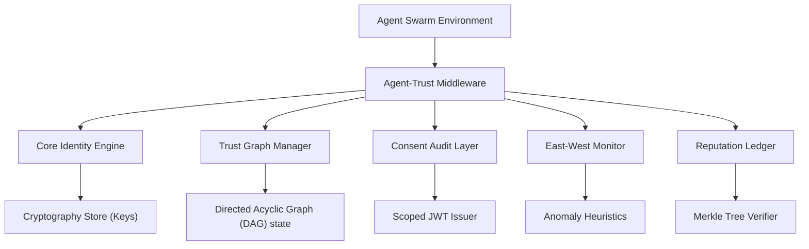
```mermaid
graph TD
    A["Agent Swarm Environment"] --> B["Agent-Trust Middleware"]
    B --> C["Core Identity Engine"]
    B --> D["Trust Graph Manager"]
    B --> E["Consent Audit Layer"]
    B --> F["East-West Monitor"]
    B --> G["Reputation Ledger"]
    C --> H["Cryptography Store (Keys)"]
    D --> I["Directed Acyclic Graph (DAG) state"]
    E --> J["Scoped JWT Issuer"]
    F --> K["Anomaly Heuristics"]
    G --> L["Merkle Tree Verifier"]
```

### 2. Core Security Gateway Interception
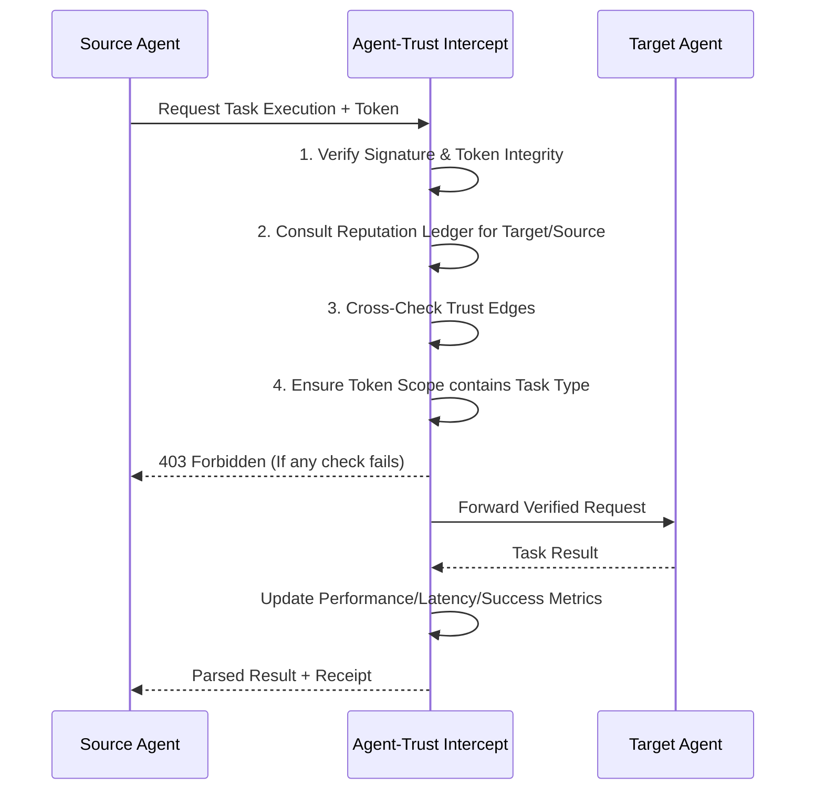
```mermaid
sequenceDiagram
    participant M as Source Agent
    participant GW as Agent-Trust Intercept
    participant T as Target Agent
    M->>GW: Request Task Execution + Token
    GW->>GW: 1. Verify Signature & Token Integrity
    GW->>GW: 2. Consult Reputation Ledger for Target/Source
    GW->>GW: 3. Cross-Check Trust Edges
    GW->>GW: 4. Ensure Token Scope contains Task Type
    GW-->>M: 403 Forbidden (If any check fails)
    GW->>T: Forward Verified Request
    T-->>GW: Task Result
    GW->>GW: Update Performance/Latency/Success Metrics
    GW-->>M: Parsed Result + Receipt
```

### 3. Identity Derivation Sequence
Identity isn't assigned; it's computed deterministically.
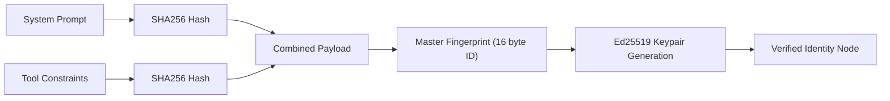
```mermaid
graph LR
    P["System Prompt"] --> X["SHA256 Hash"]
    T["Tool Constraints"] --> Y["SHA256 Hash"]
    X --> Z["Combined Payload"]
    Y --> Z
    Z --> I["Master Fingerprint (16 byte ID)"]
    I --> K["Ed25519 Keypair Generation"]
    K --> O["Verified Identity Node"]
```

### 4. Continuous Key Rotation
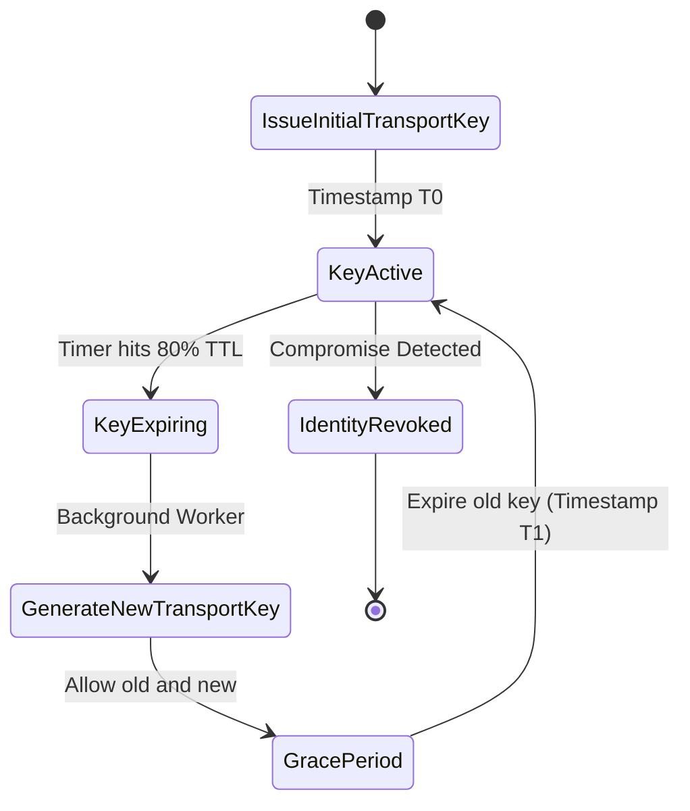
```mermaid
stateDiagram-v2
    [*] --> IssueInitialTransportKey
    IssueInitialTransportKey --> KeyActive: Timestamp T0
    KeyActive --> KeyExpiring: Timer hits 80% TTL
    KeyExpiring --> GenerateNewTransportKey: Background Worker
    GenerateNewTransportKey --> GracePeriod: Allow old and new
    GracePeriod --> KeyActive: Expire old key (Timestamp T1)
    KeyActive --> IdentityRevoked: Compromise Detected
    IdentityRevoked --> [*]
```

### 5. Delegated Consent Chains (GDPR / SOC2)
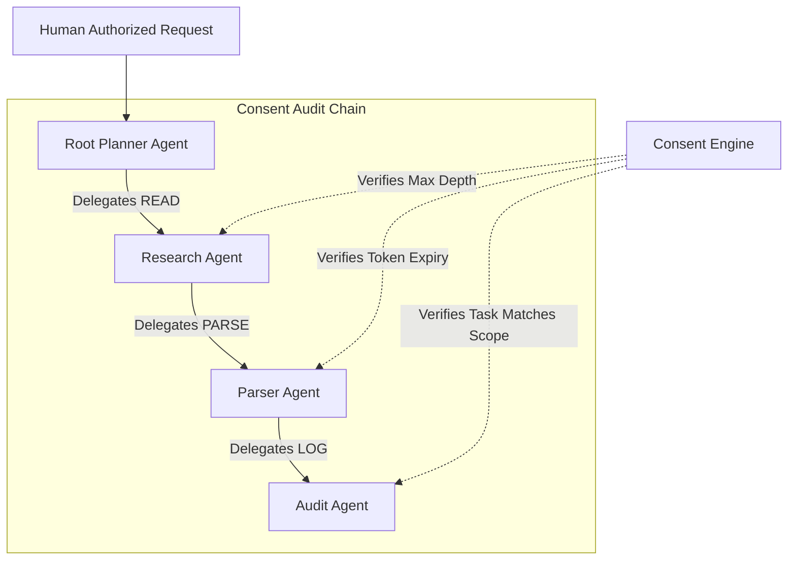
```mermaid
graph TD
    User["Human Authorized Request"] --> A1["Root Planner Agent"]
    A1 -->|"Delegates READ"| A2["Research Agent"]
    A2 -->|"Delegates PARSE"| A3["Parser Agent"]
    A3 -->|"Delegates LOG"| A4["Audit Agent"]
    subgraph ConsentChain [Consent Audit Chain]
        A1
        A2
        A3
        A4
    end
    C["Consent Engine"] -.->|"Verifies Max Depth"| A2
    C -.->|"Verifies Token Expiry"| A3
    C -.->|"Verifies Task Matches Scope"| A4
```

### 6. Cascade Trust Isolation
When circular trusts are detected, automatic islanding occurs to protect the broader swarm.
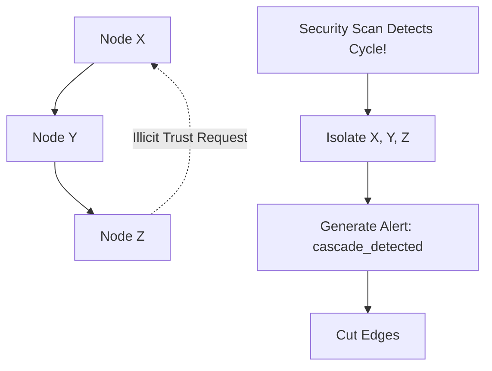
```mermaid
graph TD
    X["Node X"] --> Y["Node Y"]
    Y --> Z["Node Z"]
    Z -.->|"Illicit Trust Request"| X
    Alert["Security Scan Detects Cycle!"] --> B["Isolate X, Y, Z"]
    B --> C["Generate Alert: cascade_detected"]
    C --> D["Cut Edges"]
```

### 7. Reputation Degradation (Penalty Curve)
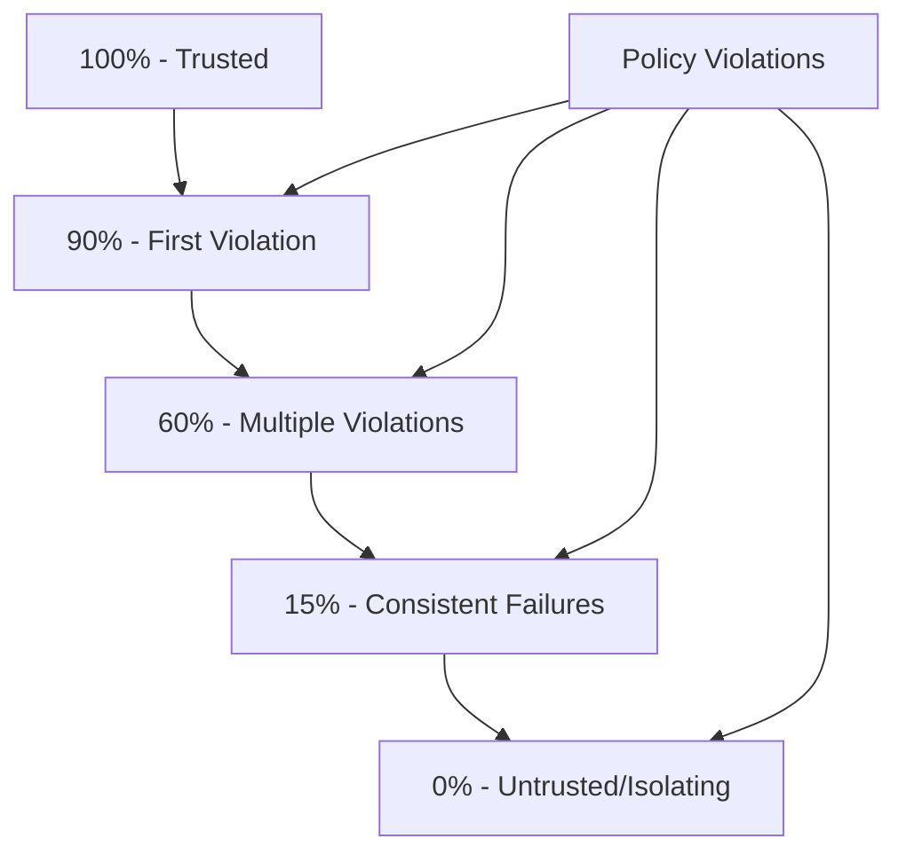
```mermaid
graph TD
    Rep1["100% - Trusted"] --> Rep2["90% - First Violation"]
    Rep2 --> Rep3["60% - Multiple Violations"]
    Rep3 --> Rep4["15% - Consistent Failures"]
    Rep4 --> Rep5["0% - Untrusted/Isolating"]
    Violations["Policy Violations"] --> Rep2
    Violations --> Rep3
    Violations --> Rep4
    Violations --> Rep5
```

### 8. Merkle Tree Reputation Validation
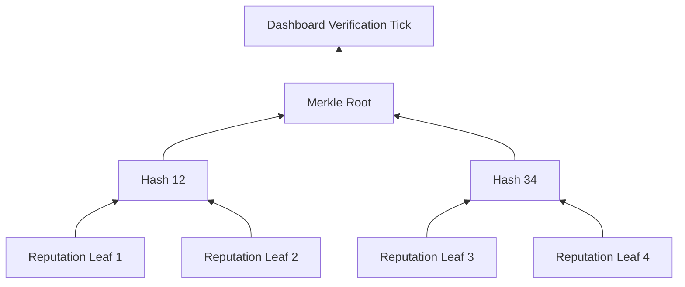
```mermaid
graph BT
    L1["Reputation Leaf 1"] --> H1["Hash 12"]
    L2["Reputation Leaf 2"] --> H1
    L3["Reputation Leaf 3"] --> H2["Hash 34"]
    L4["Reputation Leaf 4"] --> H2
    H1 --> Root["Merkle Root"]
    H2 --> Root
    Root --> V["Dashboard Verification Tick"]
```

### 9. Token Data Structure
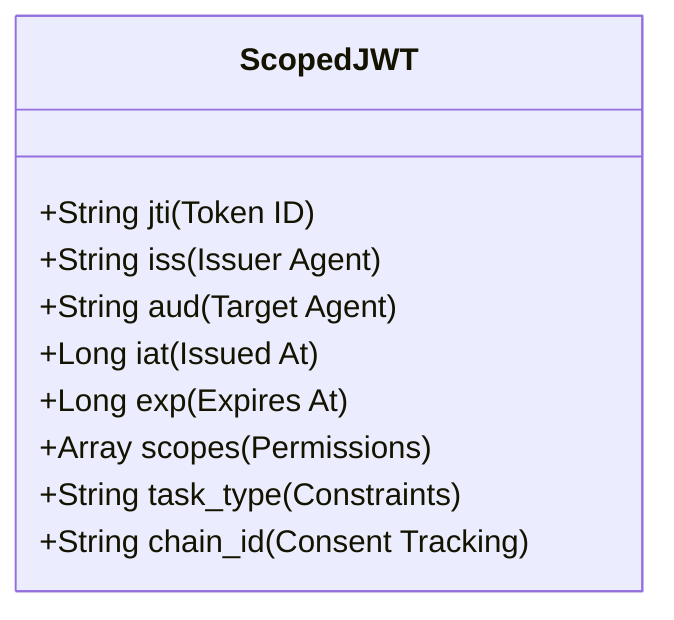
```mermaid
classDiagram
    class ScopedJWT {
        +String jti (Token ID)
        +String iss (Issuer Agent)
        +String aud (Target Agent)
        +Long iat (Issued At)
        +Long exp (Expires At)
        +Array scopes (Permissions)
        +String task_type (Constraints)
        +String chain_id (Consent Tracking)
    }
```

### 10. Dashboard API Polling Mechanism
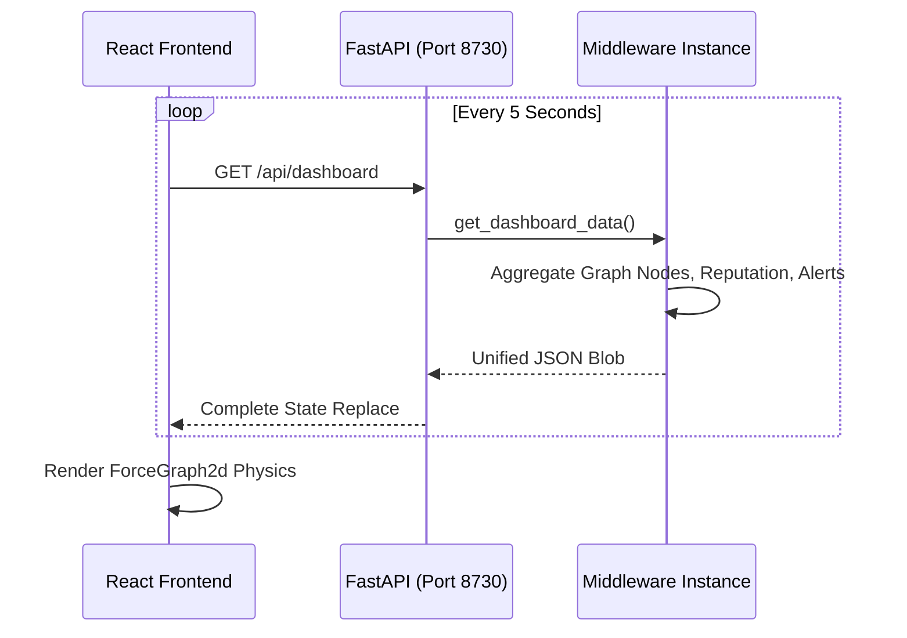
```mermaid
sequenceDiagram
    participant UI as React Frontend
    participant F as FastAPI (Port 8730)
    participant M as Middleware Instance
    loop Every 5 Seconds
    UI->>F: GET /api/dashboard
    F->>M: get_dashboard_data()
    M->>M: Aggregate Graph Nodes, Reputation, Alerts
    M-->>F: Unified JSON Blob
    F-->>UI: Complete State Replace
    end
    UI->>UI: Render ForceGraph2d Physics
```

### 11. Cross-Organization Boundary Mapping
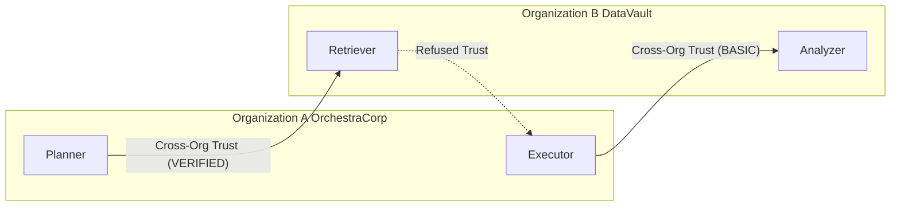
```mermaid
graph LR
    subgraph OrgA [Organization A OrchestraCorp]
        A1["Planner"]
        A2["Executor"]
    end
    subgraph OrgB [Organization B DataVault]
        B1["Retriever"]
        B2["Analyzer"]
    end
    A1 -->|"Cross-Org Trust (VERIFIED)"| B1
    A2 -->|"Cross-Org Trust (BASIC)"| B2
    B1 -.->|"Refused Trust"| A2
```

### 12. East-West Traffic Anomaly Detection
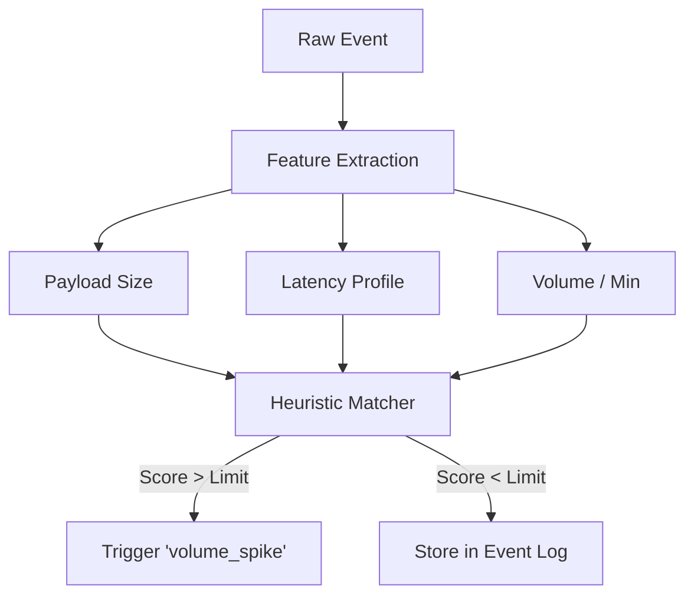
```mermaid
graph TD
    Traffic["Raw Event"] --> Ext["Feature Extraction"]
    Ext --> P["Payload Size"]
    Ext --> L["Latency Profile"]
    Ext --> V["Volume / Min"]
    P --> ML["Heuristic Matcher"]
    L --> ML
    V --> ML
    ML -->|"Score > Limit"| Alert["Trigger 'volume_spike'"]
    ML -->|"Score < Limit"| Pass["Store in Event Log"]
```

### 13. Security State Lifecycle
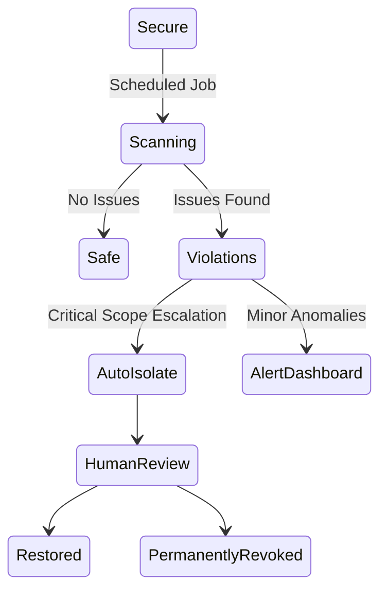
```mermaid
stateDiagram-v2
    Secure --> Scanning: Scheduled Job
    Scanning --> Safe: No Issues
    Scanning --> Violations: Issues Found
    Violations --> AutoIsolate: Critical Scope Escalation
    Violations --> AlertDashboard: Minor Anomalies
    AutoIsolate --> HumanReview
    HumanReview --> Restored
    HumanReview --> PermanentlyRevoked
```

### 14. Registration Flow
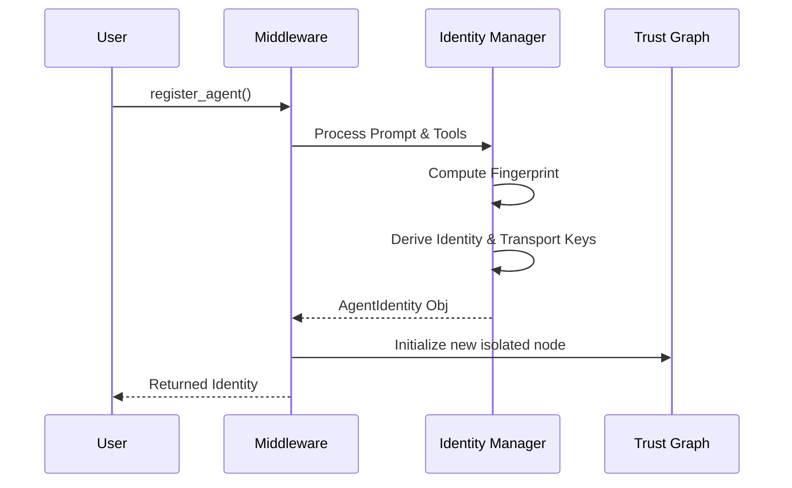
```mermaid
sequenceDiagram
    participant User
    participant MW as Middleware
    participant ID as Identity Manager
    participant Graph as Trust Graph
    User->>MW: register_agent()
    MW->>ID: Process Prompt & Tools
    ID->>ID: Compute Fingerprint
    ID->>ID: Derive Identity & Transport Keys
    ID-->>MW: AgentIdentity Obj
    MW->>Graph: Initialize new isolated node
    MW-->>User: Returned Identity
```

### 15. Trust Escalation Escalation Attack Vector
(Demonstrating what Agent-Trust prevents)
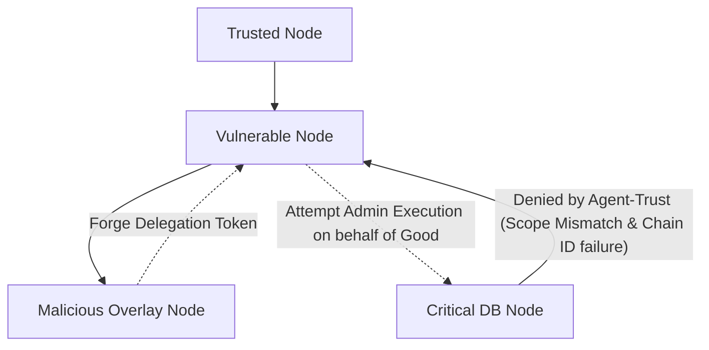
```mermaid
graph TD
    Good["Trusted Node"] --> Weak["Vulnerable Node"]
    Weak --> Bad["Malicious Overlay Node"]
    Bad -.->|"Forge Delegation Token"| Weak
    Weak -.->|"Attempt Admin Execution on behalf of Good"| Target["Critical DB Node"]
    Target -->|"Denied by Agent-Trust (Scope Mismatch & Chain ID failure)"| Weak
```

### 16. Operational Metrics Calculation
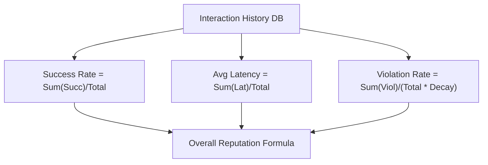
```mermaid
graph TD
    Events["Interaction History DB"]
    Events --> Succ["Success Rate = Sum(Succ)/Total"]
    Events --> Lat["Avg Latency = Sum(Lat)/Total"]
    Events --> Viol["Violation Rate = Sum(Viol)/(Total * Decay)"]
    Succ --> Rep["Overall Reputation Formula"]
    Lat --> Rep
    Viol --> Rep
```

### 17. Sandbox Intercept Architecture
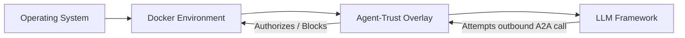
```mermaid
graph LR
    OS["Operating System"]
    Docker["Docker Environment"]
    App["LLM Framework"]
    AT["Agent-Trust Overlay"]
    OS --> Docker
    Docker --> AT
    AT --> App
    App -->|"Attempts outbound A2A call"| AT
    AT -->|"Authorizes / Blocks"| Docker
```

### 18. Centralized vs Decentralized Deployments
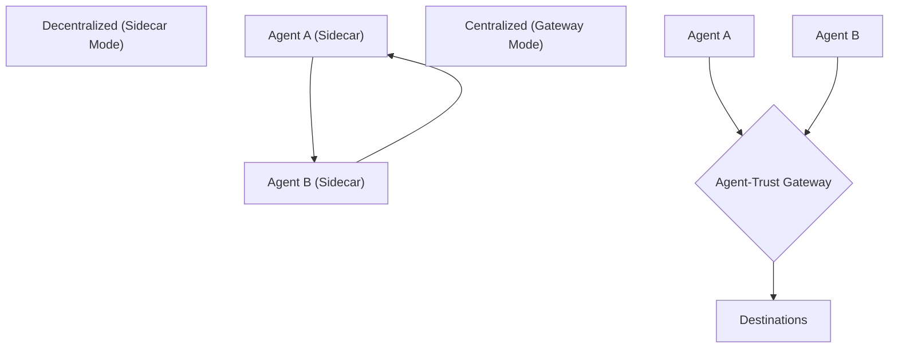
```mermaid
graph TD
    SubGraph1["Decentralized (Sidecar Mode)"]
    S1["Agent A (Sidecar)"] --> S2["Agent B (Sidecar)"]
    S2 --> S1
    
    SubGraph2["Centralized (Gateway Mode)"]
    GA["Agent A"] --> GW{"Agent-Trust Gateway"}
    GB["Agent B"] --> GW
    GW --> Target["Destinations"]
```

### 19. Key Compromise Handling Flow
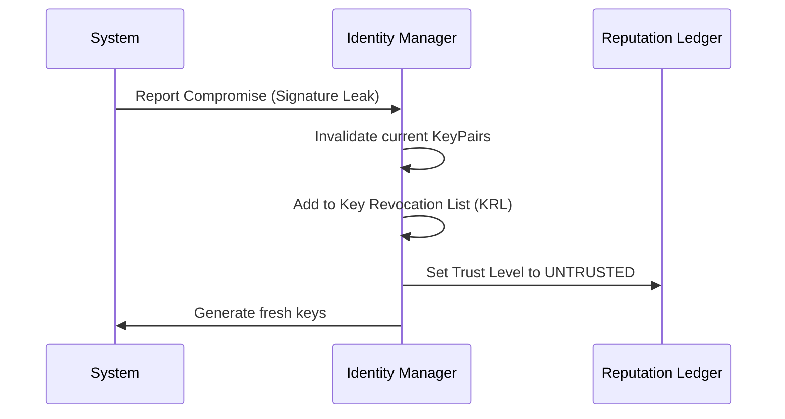
```mermaid
sequenceDiagram
    participant Sys as System
    participant ID as Identity Manager
    participant R as Reputation Ledger
    Sys->>ID: Report Compromise (Signature Leak)
    ID->>ID: Invalidate current KeyPairs
    ID->>ID: Add to Key Revocation List (KRL)
    ID->>R: Set Trust Level to UNTRUSTED
    ID->>Sys: Generate fresh keys
```

### 20. Token Consumption Timeline (Single-Use vs TTL)
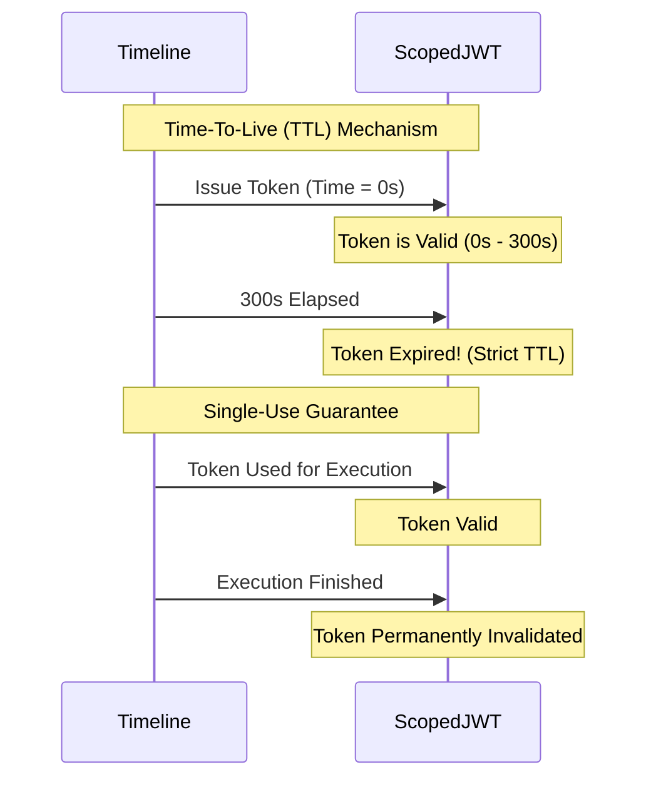
```mermaid
sequenceDiagram
    participant T as Timeline
    participant JWT as ScopedJWT
    Note over T,JWT: Time-To-Live (TTL) Mechanism
    T->>JWT: Issue Token (Time = 0s)
    Note over JWT: Token is Valid (0s - 300s)
    T->>JWT: 300s Elapsed
    Note over JWT: Token Expired! (Strict TTL)
    Note over T,JWT: Single-Use Guarantee
    T->>JWT: Token Used for Execution
    Note over JWT: Token Valid
    T->>JWT: Execution Finished
    Note over JWT: Token Permanently Invalidated
```

### 21. Live Traffic Dashboard Socket Flow
```mermaid
graph LR
    EW["East-West Monitor"] --> Q["In-Memory Buffer Ring"]
    Q -.->|"Polling Sync"| API["/api/dashboard/traffic"]
    API --> UI["React UI trafficTimeline State"]
    UI --> Chart["Recharts AreaChart"]
```

### 22. React Component Hierarchy
```mermaid
graph TD
    App["App.jsx (Root)"]
    App --> Hook["useTrustData (Fetcher)"]
    App --> Sidebar["Nav Sidebar"]
    App --> Main["Main Content Area"]
    Main --> Over["OverviewPage"]
    Main --> TG["TrustGraphPage"]
    Main --> Rep["ReputationPage"]
    Main --> Ctl["ControlDeskPage"]
    TG --> Force["react-force-graph-2d"]
```

### 23. Node Priority Weighting (For Graph Physics)
```mermaid
graph TD
    Node["Node"]
    Rep["Reputation Score"] --> Val["val = Math.max(2, score * 10)"]
    Risk["Risk Level (Low/Med/High)"] --> Color["color = Green/Orange/Red"]
    Val --> Physics["Radius/Charge in Graph"]
    Color --> Physics
```

### 24. Compliance Flag Generation
```mermaid
graph LR
    Req["Request"] --> Check1{"Depth < Limit?"}
    Check1 -->|Yes| Check2{"Token Includes Data Scope?"}
    Check2 -->|No| Alert1["GDPR Warning"]
    Check2 -->|Yes| OK["Compliance PASS"]
    Check1 -->|No| Alert2["SOC2 Warning (Chain too long)"]
```

### 25. Storage Schema Overlook (Conceptual)
```mermaid
erDiagram
    AGENT {
        string id PK
        string fingerprint
        string pub_key
    }
    TRUST_EDGE {
        string source FK
        string target FK
        int level
    }
    INTERACTION {
        string id PK
        string source FK
        string target FK
        boolean success
    }
    AGENT ||--o{ TRUST_EDGE : maintains
    AGENT ||--o{ INTERACTION : performs
```

### 26. Control Desk Interactive Lifecycle
```mermaid
sequenceDiagram
    participant Oper as Operator (UI)
    participant CD as ControlDesk Component
    participant F as FastAPI Backend
    participant MW as Middleware
    Oper->>CD: Fills 'Establish Trust' Form
    Oper->>CD: Clicks Output
    CD->>F: POST /api/trust/establish
    F->>MW: middleware.establish_trust()
    MW->>MW: Update DAG edges
    F-->>CD: 200 OK
    CD->>CD: setSuccess(msg) -> refetch()
    CD-->>Oper: Visual Feedback & UI Updates
```

### 27. The Circular Trust Bug Resolution Logic
```mermaid
graph TD
    NodeA --> NodeB
    NodeB --> NodeC
    NodeC --> NodeA
    Algo["networkx.simple_cycles(G)"] --> Scan
    Scan -->|"Cycle Found"| Warn["Log Alert"]
    Warn --> Break["Temporarily Suspend Edge C->A"]
```

### 28. Reputation Math
`score = (reliability * 0.4) + (performance * 0.3) + (compliance * 0.3)`
```mermaid
graph BT
    Rel["Successes / Total"] --> Score["Overall Score"]
    Perf["1 - Min(1, Latency_Avg / 1000)"] --> Score
    Comp["1 - (Violations / Interacts)"] --> Score
```

### 29. Alert Message Dispatching
```mermaid
graph LR
    Sys["Sub-Module (Monitor, DAG, Ledger)"]
    Sys -->|"Discrepancy"| EM["Event Manager"]
    EM --> DB["Store Alert in Memory"]
    EM --> Webhook["(Optional) External Slack/Teams Hook"]
    DB --> Dashboard["Aggregated on next UI poll"]
```

### 30. File Structure / Code Tree Overview
```mermaid
graph TD
    Root["Agent-Trust Root"]
    Root --> Core["agent_trust/ Backend"]
    Core --> CoreAPI["api/"]
    Core --> CoreMid["middleware/"]
    Core --> CoreTrust["trust_graph/"]
    Root --> FB["dashboard/ Frontend"]
    FB --> Src["src/"]
    Src --> AppJ["App.jsx Live Engine"]
    Src --> index["index.css Glassmorphism"]
```

---

## 🚀 How to Run the Ecosystem Fully

### Starting the Live Middleware Backend
```bash
# Boot the FastAPI Engine with Live Seeder
python -m agent_trust.api.server
# Runs on http://localhost:8730
```

### Starting the Operations Control Engine & Graph Visualization
```bash
# Inside the /dashboard directory
npm run dev
# Vite server boots to http://localhost:5173
```

## 🌐 The Frontend Stack Experience
* **React 19 Hooks**: Ultra-responsive live polling mechanism.
* **Frost Glassmorphism**: High tier aesthetics with dynamic lighting and `.glass-hover` classes.
* **Recharts**: For area timelines, telemetry, radar DNA scanning, and pie mapping.
* **React-Force-Graph-2D**: Real-time dependency injection visualizations.
* **Dynamic Control Desk**: Orchestrate tokens and register edges via Live HTML forms mapping directly to backend routes.

#### Maintainer
**Author**: Sandeep Kumar Sahoo (MrDecryptDecipher)  
**Email**: sandeep.savethem2@gmail.com  
**License**: MIT License
