<div align="center">
  <h1>🛡️ Agent-Trust</h1>
  <p><b>The Trust & Reputation Layer That A2A Forgot to Build</b></p>
  <p><i>Authored by <b>Sandeep Kumar Sahoo (MrDecryptDecipher)</b></i></p>
</div>

---

## 📖 Introduction to East-West Cybersecurity for Agents

Traditional cybersecurity focuses on "north-south" (client-to-server) traffic. However, in an AI-agent-heavy ecosystem, agents rely on **"east-west"** (agent-to-agent) communication. The gap? **A2A handles communication but does not solve trust.** A malicious node deep in the dependency chain can cascadingly compromise root planner agents without raising internet-facing flags. 

Agent-Trust is an embedded middleware, cryptographic identity manager, reputation ledger, and zero-trust policy engine engineered specifically for Agentic swarms, built as a pluggable overlay.

---

## 🛠️ Extensive Architectural Flows

Below is a detailed engineering documentation mapping out the exact state machines, lifecycles, and verification flows inside the `Agent-Trust` infrastructure. All diagrams strictly adhere to GitHub-compatible Mermaid definitions.

### 1. High-Level Macro Architecture
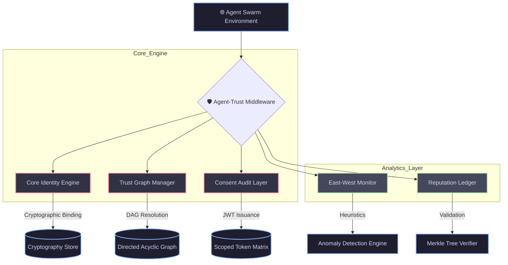
```mermaid
graph TD
    classDef sys fill:#1e1e2e,stroke:#89b4fa,stroke-width:2px,color:#cdd6f4;
    classDef core fill:#313244,stroke:#f38ba8,stroke-width:2px,color:#cdd6f4;
    classDef mod fill:#45475a,stroke:#a6e3a1,stroke-width:2px,color:#cdd6f4;
    
    A["🌐 Agent Swarm Environment"]:::sys --> B{"🛡️ Agent-Trust Middleware"}
    
    subgraph Core_Engine
        B --> C["Core Identity Engine"]:::core
        B --> D["Trust Graph Manager"]:::core
        B --> E["Consent Audit Layer"]:::core
    end
    
    subgraph Analytics_Layer
        B --> F["East-West Monitor"]:::mod
        B --> G["Reputation Ledger"]:::mod
    end
    
    C -- "Cryptographic Binding" --> H[("Cryptography Store")]:::sys
    D -- "DAG Resolution" --> I[("Directed Acyclic Graph")]:::sys
    E -- "JWT Issuance" --> J[("Scoped Token Matrix")]:::sys
    F -- "Heuristics" --> K["Anomaly Detection Engine"]:::sys
    G -- "Validation" --> L["Merkle Tree Verifier"]:::sys
```

### 2. Core Security Gateway Interception
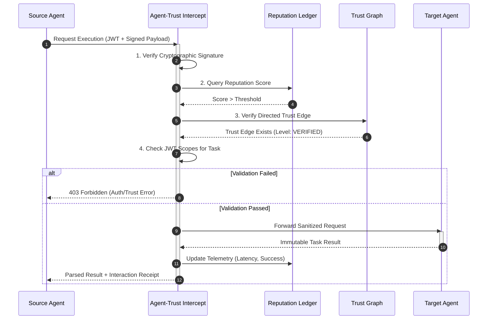
```mermaid
sequenceDiagram
    autonumber
    participant M as Source Agent
    participant GW as Agent-Trust Intercept
    participant Ledger as Reputation Ledger
    participant Graph as Trust Graph
    participant T as Target Agent
    
    M->>GW: Request Execution (JWT + Signed Payload)
    activate GW
    GW->>GW: 1. Verify Cryptographic Signature
    GW->>Ledger: 2. Query Reputation Score
    Ledger-->>GW: Score > Threshold
    GW->>Graph: 3. Verify Directed Trust Edge
    Graph-->>GW: Trust Edge Exists (Level: VERIFIED)
    GW->>GW: 4. Check JWT Scopes for Task
    alt Validation Failed
        GW-->>M: 403 Forbidden (Auth/Trust Error)
    else Validation Passed
        GW->>T: Forward Sanitized Request
        activate T
        T-->>GW: Immutable Task Result
        deactivate T
        GW->>Ledger: Update Telemetry (Latency, Success)
        GW-->>M: Parsed Result + Interaction Receipt
    end
    deactivate GW
```

### 3. Identity Derivation Sequence
Identity isn't assigned; it's computed deterministically.
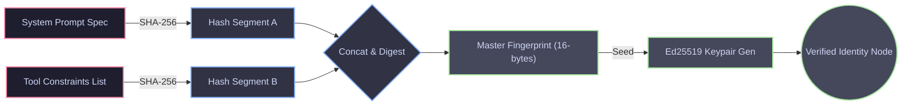
```mermaid
graph LR
    classDef in fill:#1e1e2e,stroke:#f38ba8,stroke-width:2px,color:#cdd6f4;
    classDef hash fill:#313244,stroke:#89b4fa,stroke-width:2px,color:#cdd6f4;
    classDef out fill:#45475a,stroke:#a6e3a1,stroke-width:2px,color:#cdd6f4;

    P["System Prompt Spec"]:::in -->|SHA-256| X["Hash Segment A"]:::hash
    T["Tool Constraints List"]:::in -->|SHA-256| Y["Hash Segment B"]:::hash
    X --> Z{"Concat & Digest"}:::hash
    Y --> Z
    Z --> I["Master Fingerprint (16-bytes)"]:::out
    I -- "Seed" --> K["Ed25519 Keypair Gen"]:::out
    K --> O(("Verified Identity Node")):::out
```

### 4. Continuous Key Rotation
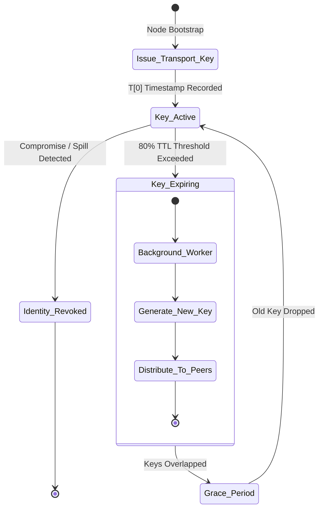
```mermaid
stateDiagram-v2
    [*] --> Issue_Transport_Key: Node Bootstrap
    Issue_Transport_Key --> Key_Active: T[0] Timestamp Recorded
    Key_Active --> Key_Expiring: 80% TTL Threshold Exceeded
    
    state Key_Expiring {
        [*] --> Background_Worker
        Background_Worker --> Generate_New_Key
        Generate_New_Key --> Distribute_To_Peers
        Distribute_To_Peers --> [*]
    }
    
    Key_Expiring --> Grace_Period: Keys Overlapped
    Grace_Period --> Key_Active: Old Key Dropped
    Key_Active --> Identity_Revoked: Compromise / Spill Detected
    Identity_Revoked --> [*]
```

### 5. Delegated Consent Chains (GDPR / SOC2)
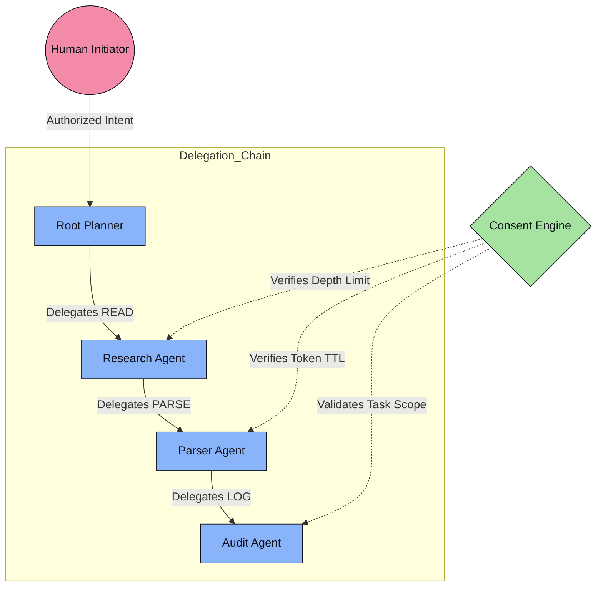
```mermaid
graph TD
    classDef human fill:#f38ba8,stroke:#11111b,color:#11111b;
    classDef agent fill:#89b4fa,stroke:#11111b,color:#11111b;
    classDef security fill:#a6e3a1,stroke:#11111b,color:#11111b;

    User(("Human Initiator")):::human -- "Authorized Intent" --> A1["Root Planner"]:::agent
    
    subgraph Delegation_Chain
        A1 -- "Delegates READ" --> A2["Research Agent"]:::agent
        A2 -- "Delegates PARSE" --> A3["Parser Agent"]:::agent
        A3 -- "Delegates LOG" --> A4["Audit Agent"]:::agent
    end
    
    C{"Consent Engine"}:::security -. "Verifies Depth Limit" .-> A2
    C -. "Verifies Token TTL" .-> A3
    C -. "Validates Task Scope" .-> A4
```

### 6. Cascade Trust Isolation
When circular trusts are detected, automatic islanding occurs to protect the broader swarm.
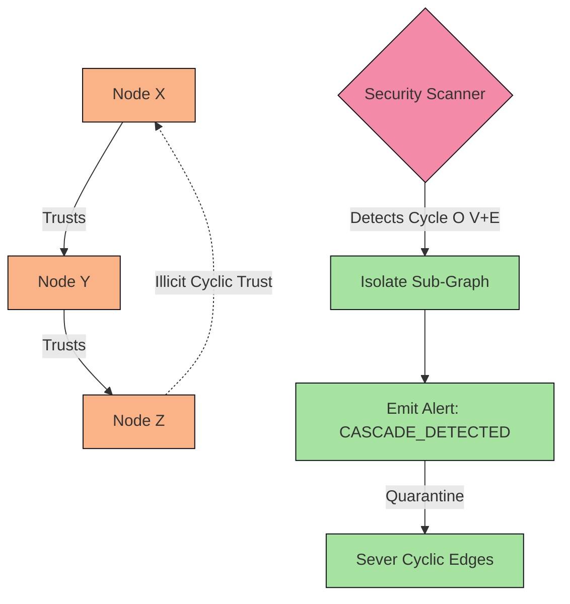
```mermaid
graph TD
    classDef vuln fill:#fab387,stroke:#11111b;
    classDef safe fill:#a6e3a1,stroke:#11111b;
    classDef defense fill:#f38ba8,stroke:#11111b;

    X["Node X"]:::vuln -->|Trusts| Y["Node Y"]:::vuln
    Y -->|Trusts| Z["Node Z"]:::vuln
    Z -. "Illicit Cyclic Trust" .-> X
    
    Alert{"Security Scanner"}:::defense -- "Detects Cycle O V+E" --> B["Isolate Sub-Graph"]:::safe
    B --> C["Emit Alert: CASCADE_DETECTED"]:::safe
    C -- "Quarantine" --> D["Sever Cyclic Edges"]:::safe
```

### 7. Reputation Degradation Graph
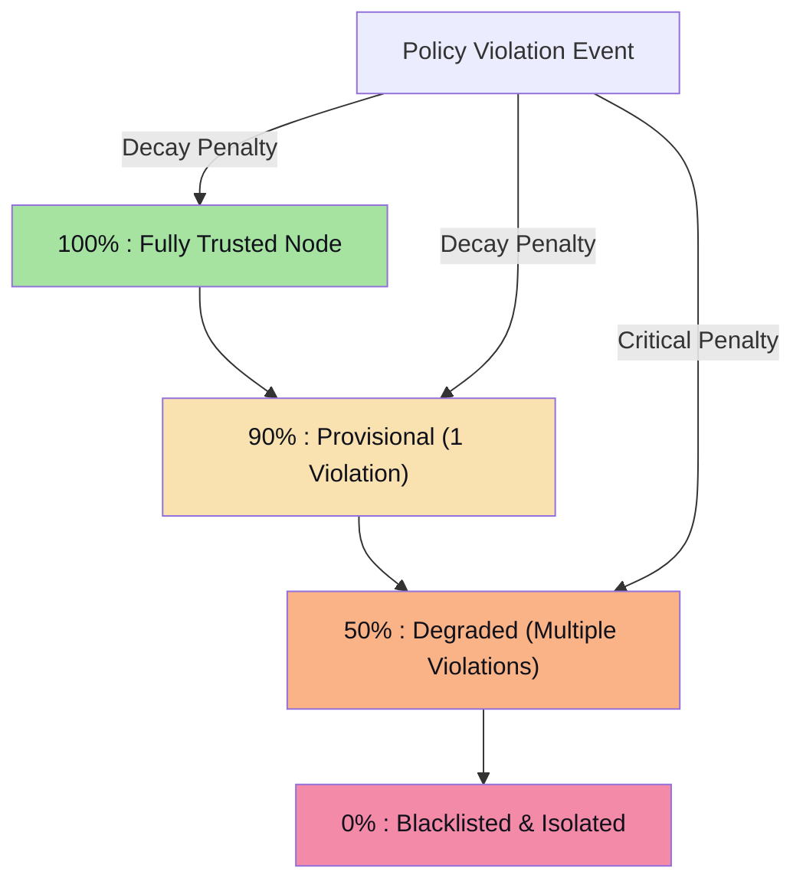
```mermaid
graph TD
    classDef tier1 fill:#a6e3a1,color:#11111b;
    classDef tier2 fill:#f9e2af,color:#11111b;
    classDef tier3 fill:#fab387,color:#11111b;
    classDef tier4 fill:#f38ba8,color:#11111b;

    R1["100% : Fully Trusted Node"]:::tier1
    R2["90% : Provisional (1 Violation)"]:::tier2
    R3["50% : Degraded (Multiple Violations)"]:::tier3
    R4["0% : Blacklisted & Isolated"]:::tier4

    V["Policy Violation Event"]
    
    V -- "Decay Penalty" --> R1
    R1 --> R2
    V -- "Decay Penalty" --> R2
    R2 --> R3
    V -- "Critical Penalty" --> R3
    R3 --> R4
```

### 8. Merkle Tree Structure
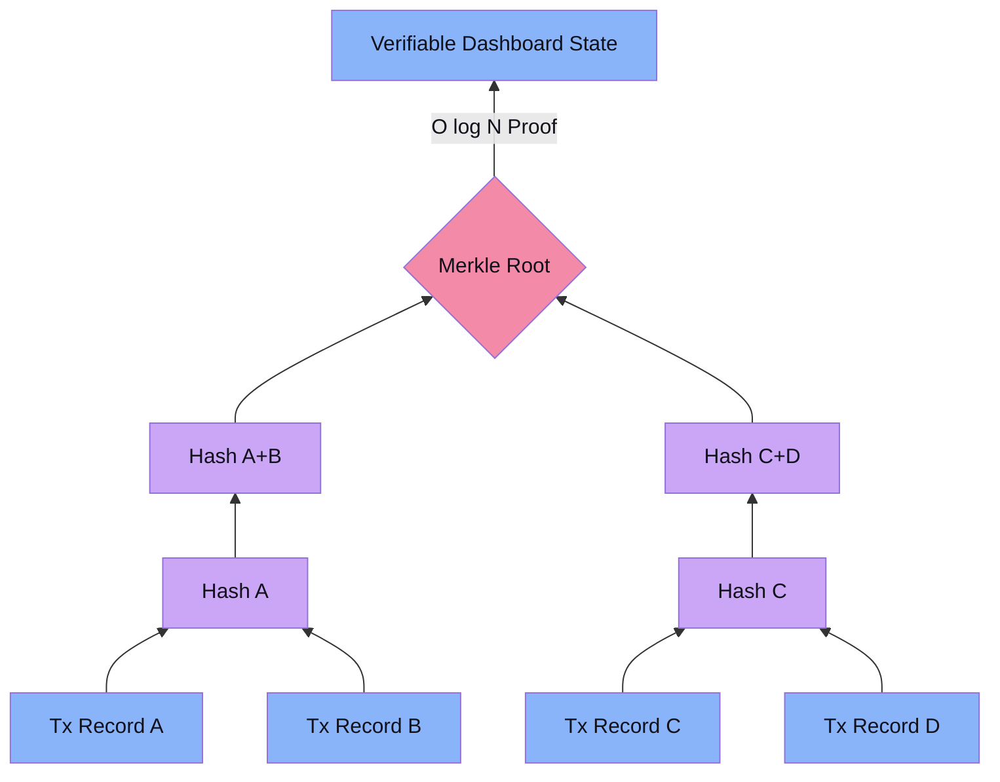
```mermaid
graph BT
    classDef leaf fill:#89b4fa,color:#11111b;
    classDef hash fill:#cba6f7,color:#11111b;
    classDef root fill:#f38ba8,color:#11111b;

    L1["Tx Record A"]:::leaf --> H1["Hash A"]:::hash
    L2["Tx Record B"]:::leaf --> H1
    L3["Tx Record C"]:::leaf --> H2["Hash C"]:::hash
    L4["Tx Record D"]:::leaf --> H2
    H1 --> H12["Hash A+B"]:::hash
    H2 --> H34["Hash C+D"]:::hash
    H12 --> Root{"Merkle Root"}:::root
    H34 --> Root
    Root -- "O log N Proof" --> V["Verifiable Dashboard State"]:::leaf
```

### 9. Token Data Structure
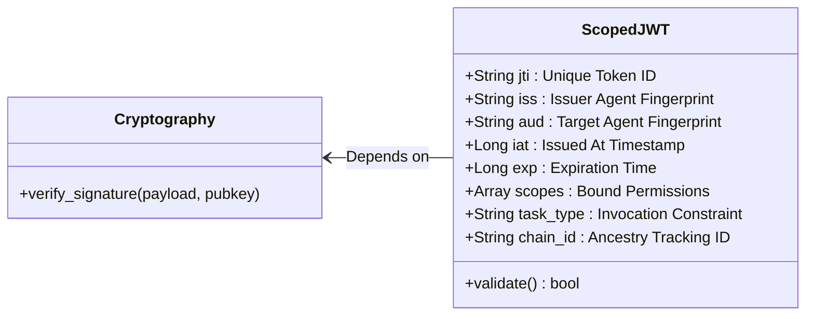
```mermaid
classDiagram
    direction RL
    class ScopedJWT {
        +String jti : Unique Token ID
        +String iss : Issuer Agent Fingerprint
        +String aud : Target Agent Fingerprint
        +Long iat : Issued At Timestamp
        +Long exp : Expiration Time
        +Array scopes : Bound Permissions
        +String task_type : Invocation Constraint
        +String chain_id : Ancestry Tracking ID
        +validate() bool
    }
    class Cryptography {
        +verify_signature(payload, pubkey)
    }
    ScopedJWT --> Cryptography : Depends on
```

### 10. API Polling Subsystem
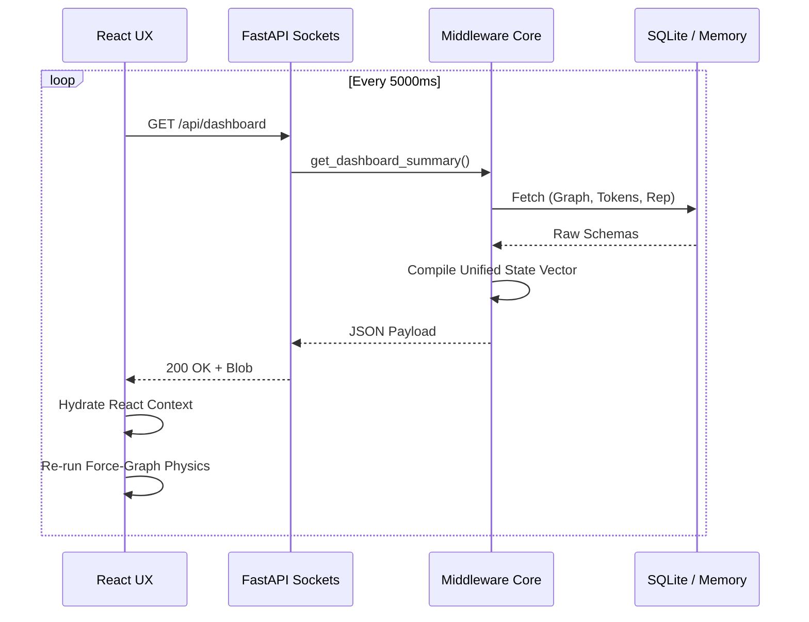
```mermaid
sequenceDiagram
    participant UI as React UX 
    participant F as FastAPI Sockets
    participant M as Middleware Core
    participant DB as SQLite / Memory
    
    loop Every 5000ms
        UI->>F: GET /api/dashboard
        F->>M: get_dashboard_summary()
        M->>DB: Fetch (Graph, Tokens, Rep)
        DB-->>M: Raw Schemas
        M->>M: Compile Unified State Vector
        M-->>F: JSON Payload
        F-->>UI: 200 OK + Blob
        UI->>UI: Hydrate React Context
        UI->>UI: Re-run Force-Graph Physics
    end
```

### 11. Geographic / Organizational Boundaries

```mermaid
graph LR
    classDef org fill:#313244,stroke:#89b4fa,stroke-width:2px;
    classDef ag fill:#cba6f7,stroke:#11111b,color:#11111b;

    subgraph Org_A
        A1("Planner Root"):::ag
        A2("Code Executor"):::ag
    end

    subgraph Org_B
        B1("Data Retriever"):::ag
        B2("Log Analyzer"):::ag
    end

    A1 -- "VERIFIED Edge" --> B1
    A2 -- "BASIC Edge" --> B2
    B1 -. "Trust Denied / Out of Scope" .-> A2
```

### 12. East-West Heuristics
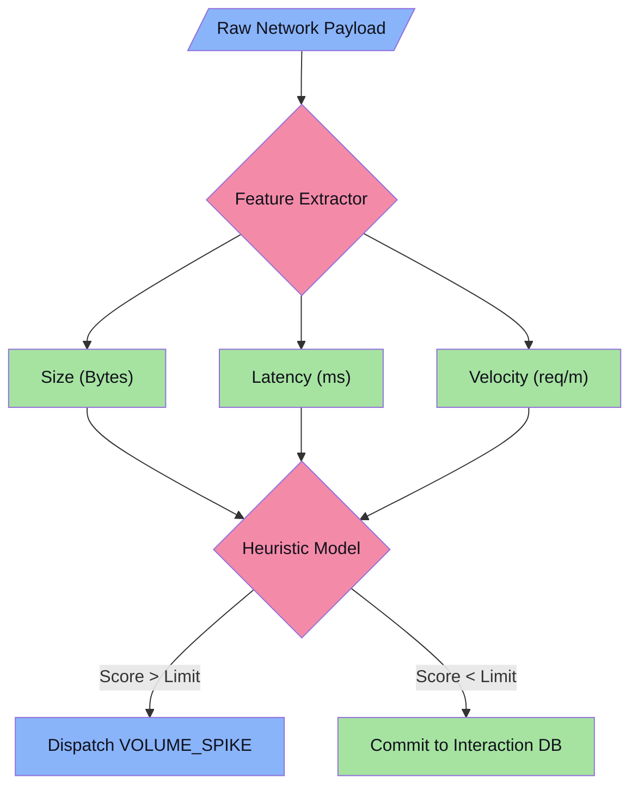
```mermaid
graph TD
    classDef data fill:#89b4fa,color:#11111b;
    classDef ml fill:#f38ba8,color:#11111b;
    classDef sys fill:#a6e3a1,color:#11111b;

    Traffic[/"Raw Network Payload"/]:::data --> Ext{"Feature Extractor"}:::ml
    Ext --> P["Size (Bytes)"]:::sys
    Ext --> L["Latency (ms)"]:::sys
    Ext --> V["Velocity (req/m)"]:::sys
    
    P --> ML{"Heuristic Model"}:::ml
    L --> ML
    V --> ML
    
    ML -- "Score > Limit" --> Alert["Dispatch VOLUME_SPIKE"]:::data
    ML -- "Score < Limit" --> Pass["Commit to Interaction DB"]:::sys
```

### 13. State Machine: Threat Triage
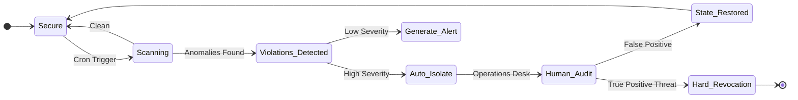
```mermaid
stateDiagram-v2
    direction LR
    [*] --> Secure
    Secure --> Scanning: Cron Trigger
    Scanning --> Secure: Clean
    Scanning --> Violations_Detected: Anomalies Found
    
    Violations_Detected --> Auto_Isolate: High Severity
    Violations_Detected --> Generate_Alert: Low Severity
    
    Auto_Isolate --> Human_Audit: Operations Desk
    Human_Audit --> State_Restored: False Positive
    State_Restored --> Secure
    Human_Audit --> Hard_Revocation: True Positive Threat
    Hard_Revocation --> [*]
```

### 14. Registration Lifecycle
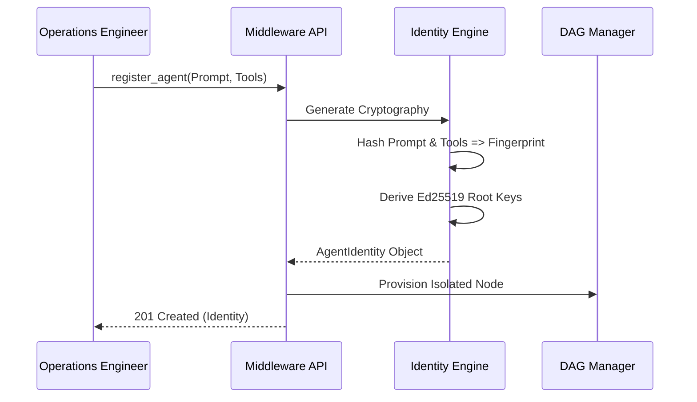
```mermaid
sequenceDiagram
    participant O as Operations Engineer
    participant MW as Middleware API
    participant Engine as Identity Engine
    participant G as DAG Manager
    
    O->>MW: register_agent(Prompt, Tools)
    MW->>Engine: Generate Cryptography
    Engine->>Engine: Hash Prompt & Tools => Fingerprint
    Engine->>Engine: Derive Ed25519 Root Keys
    Engine-->>MW: AgentIdentity Object
    MW->>G: Provision Isolated Node
    MW-->>O: 201 Created (Identity)
```

### 15. The 'Confused Deputy' Attack Vector
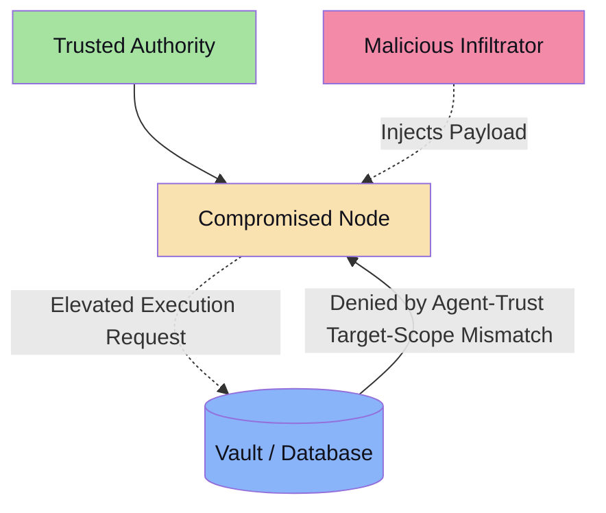
```mermaid
graph TD
    classDef good fill:#a6e3a1,color:#11111b;
    classDef weak fill:#f9e2af,color:#11111b;
    classDef bad fill:#f38ba8,color:#11111b;
    classDef db fill:#89b4fa,color:#11111b;

    Good["Trusted Authority"]:::good --> Weak["Compromised Node"]:::weak
    Bad["Malicious Infiltrator"]:::bad -. "Injects Payload" .-> Weak
    Weak -. "Elevated Execution Request" .-> Target[("Vault / Database")]:::db
    
    Target -- "Denied by Agent-Trust Target-Scope Mismatch" --> Weak
```

### 16. Formulas & Metrics Engine
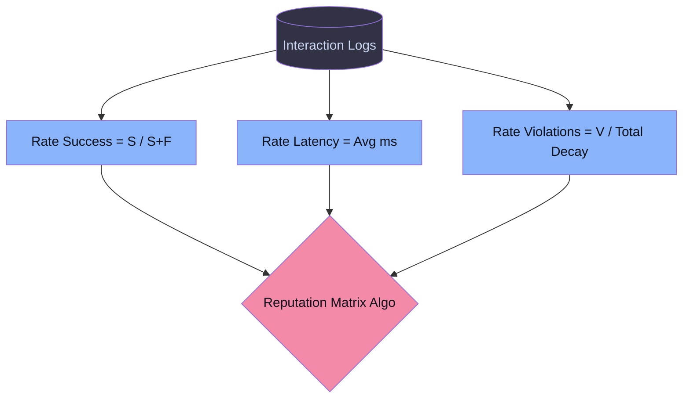
```mermaid
graph TD
    classDef log fill:#313244,color:#cdd6f4;
    classDef calc fill:#89b4fa,color:#11111b;
    classDef out fill:#f38ba8,color:#11111b;

    Events[("Interaction Logs")]:::log --> Succ["Rate Success = S / S+F"]:::calc
    Events --> Lat["Rate Latency = Avg ms"]:::calc
    Events --> Viol["Rate Violations = V / Total Decay"]:::calc
    
    Succ --> Rep{"Reputation Matrix Algo"}:::out
    Lat --> Rep
    Viol --> Rep
```

### 17. Environment Sandbox Overlay
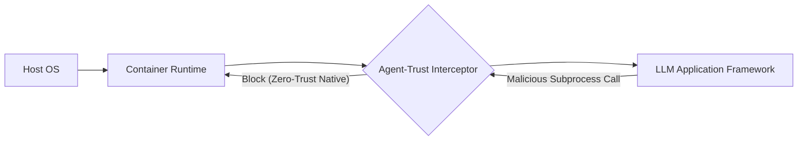
```mermaid
graph LR
    OS["Host OS"] --> Docker["Container Runtime"]
    Docker --> AT{"Agent-Trust Interceptor"}
    AT --> App["LLM Application Framework"]
    
    App -- "Malicious Subprocess Call" --> AT
    AT -- "Block (Zero-Trust Native)" --> Docker
```

### 18. Centralized Hub vs Decentralized Mesh
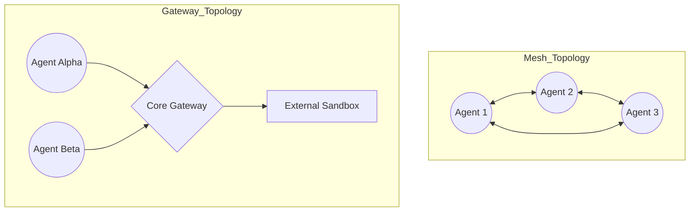
```mermaid
graph TD
    subgraph Mesh_Topology
        S1(("Agent 1")) <--> S2(("Agent 2"))
        S2 <--> S3(("Agent 3"))
        S3 <--> S1
    end
    
    subgraph Gateway_Topology
        GA(("Agent Alpha")) --> GW{"Core Gateway"}
        GB(("Agent Beta")) --> GW
        GW --> Target["External Sandbox"]
    end
```

### 19. Complete Paradigm Shift
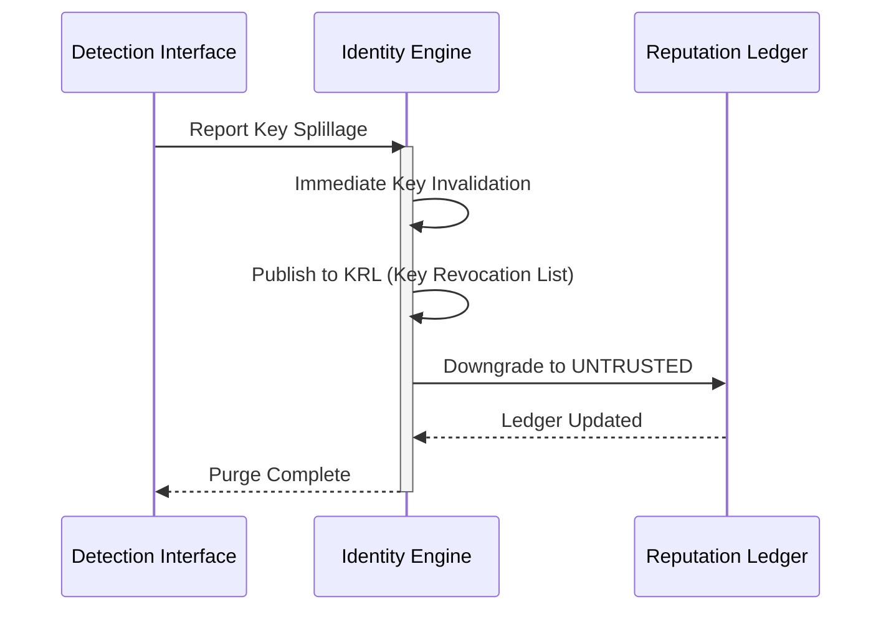
```mermaid
sequenceDiagram
    participant S as Detection Interface
    participant ID as Identity Engine
    participant R as Reputation Ledger
    
    S->>ID: Report Key Splillage
    activate ID
    ID->>ID: Immediate Key Invalidation
    ID->>ID: Publish to KRL (Key Revocation List)
    ID->>R: Downgrade to UNTRUSTED
    R-->>ID: Ledger Updated
    ID-->>S: Purge Complete
    deactivate ID
```

### 20. Token Consumption Timeline
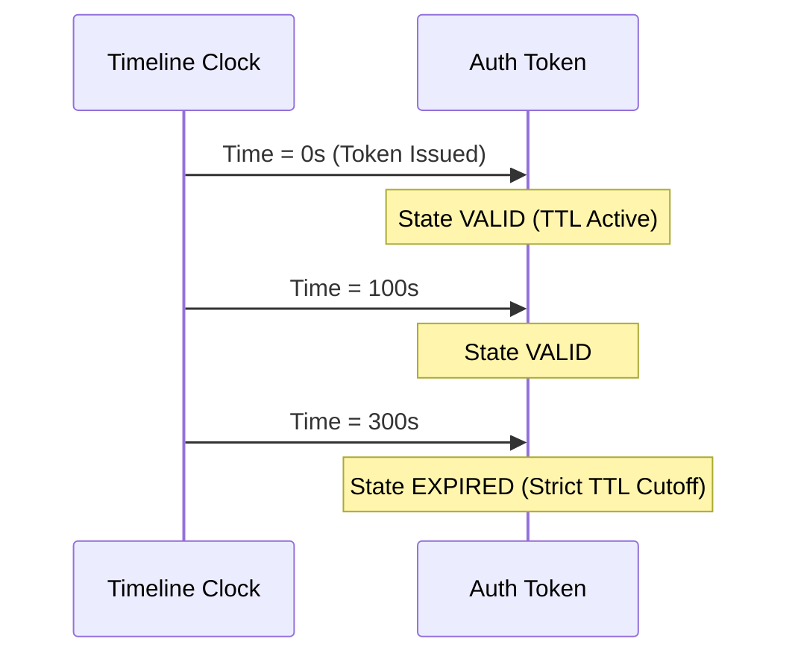
```mermaid
sequenceDiagram
    participant T as Timeline Clock
    participant JWT as Auth Token
    
    T->>JWT: Time = 0s (Token Issued)
    Note over JWT: State VALID (TTL Active)
    T->>JWT: Time = 100s
    Note over JWT: State VALID
    T->>JWT: Time = 300s
    Note over JWT: State EXPIRED (Strict TTL Cutoff)
```

### 21. Live Traffic Stream
```mermaid
graph LR
    classDef event fill:#89b4fa,color:#11111b;
    classDef mem fill:#f38ba8,color:#11111b;
    classDef ui fill:#a6e3a1,color:#11111b;

    EW["East-West Intercept"]:::event --> Q[("In-Memory Buffer")]:::mem
    Q -. "Polling Endpoint Pull" .-> API["GET /dashboard/traffic"]:::event
    API --> React["React State Mutator"]:::ui
    React --> Chart["D3.js / Recharts Render"]:::ui
```

### 22. React 19 Client Component Tree
```mermaid
graph TD
    classDef hook fill:#cba6f7,color:#11111b;
    classDef comp fill:#89b4fa,color:#11111b;

    App["App.jsx Root"]:::comp --> Hook{"useTrustData()"}:::hook
    App --> Main["Content Router"]:::comp
    
    Main --> Over["Metrics Overview"]:::comp
    Main --> TG["Trust Graph Engine"]:::comp
    Main --> Rep["Reputation Ledger UI"]:::comp
    Main --> Ctl["Control Operations Desk"]:::comp
    
    TG --> Force["Force-Graph-2D Canvas"]:::hook
```

### 23. Physics Engine Algorithms
```mermaid
graph TD
    classDef raw fill:#313244,color:#cdd6f4;
    classDef math fill:#89b4fa,color:#11111b;
    classDef phys fill:#f38ba8,color:#11111b;

    Node["Agent Node Data"]:::raw --> Val{"Calculation max2, score * 10"}:::math
    Node --> Risk{"Risk String Matcher"}:::math
    
    Val --> Rad["Physics Radius"]:::phys
    Risk --> Col["Node Paint Color"]:::phys
    Rad --> Engine["React Force Render Engine"]:::phys
    Col --> Engine
```

### 24. Zero-Trust Access Flags
```mermaid
graph LR
    Req[("API Request")] --> Check1{"Chain Depth < Limit?"}
    Check1 -- "YES" --> Check2{"Token Has Scope?"}
    Check2 -- "NO" --> Alert1["Flag: Scope Mismatch"]
    Check2 -- "YES" --> OK["Result: Granted"]
    Check1 -- "NO" --> Alert2["Flag: Depth Limit Exceeded"]
```

### 25. Storage Schema ORM
```mermaid
erDiagram
    AGENT {
        string UUID PK
        string Fingerprint UK
        string Ed25519_Pub_Key
        float Reputation_Score
    }
    TRUST_EDGE {
        string Source_ID FK
        string Target_ID FK
        int Trust_Enum_Level
        timestamp Created_At
    }
    INTERACTION {
        string Request_ID PK
        string Source_ID FK
        string Target_ID FK
        boolean Was_Successful
        float Latency_Ms
    }
    AGENT ||--o{ TRUST_EDGE : maintains
    AGENT ||--o{ INTERACTION : executes
```

### 26. Admin Control Execution Cycle
```mermaid
sequenceDiagram
    participant User as System Admin
    participant UI as React Dashboard
    participant API as FastAPI Backend
    participant DAG as Graph Engine
    
    User->>UI: Submit Trust Form (Source -> Target)
    activate UI
    UI->>API: HTTP POST /api/trust/establish
    activate API
    API->>DAG: append_edge(s, t, level)
    DAG-->>API: Graph Recomputed
    API-->>UI: 200 OK + Updated State
    deactivate API
    UI->>UI: setSuccess(msg) & Re-fetch
    UI-->>User: Visual Physics Update
    deactivate UI
```

### 27. Cycle Interruption Logic
```mermaid
graph TD
    classDef node fill:#89b4fa,color:#11111b;
    classDef alg fill:#f38ba8,color:#11111b;
    
    NodeA(("Node A")):::node --> NodeB(("Node B")):::node
    NodeB --> NodeC(("Node C")):::node
    NodeC --> NodeA
    
    Algo{"networkx.simple_cycles"}:::alg --> Scan["Scan Complete DAG"]:::alg
    Scan -- "Identified Triad Loop" --> Break["Suspend Edge C -> A"]:::alg
```

### 28. Reputation Bayesian Math
```mermaid
graph BT
    classDef sub fill:#313244,color:#cdd6f4;
    classDef out fill:#a6e3a1,color:#11111b;

    Rel["W1: Success / Total"]:::sub --> Score{"Aggregated Reputation Score"}:::out
    Perf["W2: 1 - min1, ms / 1000"]:::sub --> Score
    Comp["W3: 1 - Violations / Total"]:::sub --> Score
```

### 29. Alert Message Dispatch Pipeline
```mermaid
graph LR
    Sys["Agent-Trust Modules"] -->|Throws Exception| EM{"Event Interceptor"}
    EM --> DB[("In-Memory SQLite")]
    EM --> Hook["Enterprise Webhooks"]
    DB --> UI["Dashboard API Fetch"]
```

### 30. Code Framework Distribution
```mermaid
graph TD
    Root{"Agent-Trust Root"}
    
    Root --> Core["agent_trust/ Python Library"]
    Core --> CoreAPI["api/ FastAPI Core"]
    Core --> CoreMid["middleware/ Core Overlays"]
    Core --> CoreTrust["trust_graph/ DAG Engine"]
    
    Root --> FB["dashboard/ Vite/React SPA"]
    FB --> Src["src/"]
    Src --> AppJ["App.jsx Live Pollers"]
    Src --> index["index.css Styling"]
```

---

## 🚀 How to Run the Ecosystem Fully

### Starting the Live Middleware Backend
```bash
# Boot the FastAPI Engine with Live Seeder
python -m agent_trust.api.server
# Runs on http://localhost:8730
```

### Starting the Operations Control Engine & Graph Visualization
```bash
# Inside the /dashboard directory
npm run dev
# Vite server boots to http://localhost:5173
```

## 🌐 The Frontend Stack Experience
* **React 19 Hooks**: Ultra-responsive live polling mechanism.
* **Frost Glassmorphism**: High tier aesthetics with dynamic lighting and `.glass-hover` classes.
* **Recharts**: For area timelines, telemetry, radar DNA scanning, and pie mapping.
* **React-Force-Graph-2D**: Real-time dependency injection visualizations.
* **Dynamic Control Desk**: Orchestrate tokens and register edges via Live HTML forms mapping directly to backend routes.

#### Maintainer
**Author**: Sandeep Kumar Sahoo (MrDecryptDecipher)  
**Email**: sandeep.savethem2@gmail.com  
**License**: MIT License
